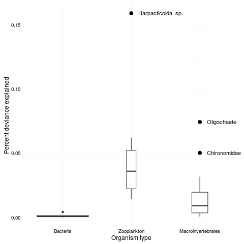

```{r echo=FALSE}
fig_nums <- captioner()
tab_nums <- captioner(prefix = "Table")
fig <- pryr::partial(fig_nums, display = "cite")
tab <- pryr::partial(tab_nums, display = "cite")
```


## Introduction

One of the most profound differences between organisms is their body
size. Macroscopic (> 1mm) and microscopic (< 1 mm) animals differ in
population size, growth rates, morphological complexity, genome size,
and modes of dispersal. These biological properties are
in turn expected to affect rates of speciation, dispersal, selection
and drift -- the four processes underlying community assembly. In this
framework, speciation populates the regional pool, dispersal refers to
the arrival of species into a local community, “selection” to
differences among species in their response to environment or other
species, and “drift” to changes in species abundances resulting from
stochastic demographic processes. These four processes together can
describe all of the contemporary models of community ecology
[@Vellend2010b;@Hanson2012;@Chase2011]. Understanding how macroscopic
and microscopic organisms differ in these four processes is a
necessary first step to understanding differences in assembly between
these groups.

If microscopic and macroscopic communities are assembled by different processes,
we would expect to see difference in their distribution. Indeed, this is often
the case. Microscopic organisms are often globally distributed, while
macroscopic organisms have more geographically restricted distributions [@Fenchel2004]. Even
within landscapes, there is some evidence that the occurrence of microscopic organisms respond
less to environmental gradients than macroscopic organisms
[@Farjalla2012;@Fierer2011].  However, while such differences in distribution
suggest that the suite of processes underlying community assembly differ between
micro- and macroscopic organisms, it is difficult to determine which process is
driving this difference. There are at least two possible mechanisms that may make
communities of smaller organisms more widely distributed. First, smaller
organisms could have larger environmental tolerances, allowing them to occupy
broader fundamental niches. Second, smaller organisms could have greater
dispersal abilities, allowing them to reach more habitats.

The environment may not affect small-bodied organisms if they have large
fundamental niches, causing weaker selection (_sensu_ Vellend) in response to different environments. Larger fundamental niches in smaller organisms could be caused by
several factors. First, their small body size allows habitat heterogeneity to
affect them at very small scales:  smaller organisms are able to find tolerable
microhabitats, while organisms that experience the environment at a coarser grain may not detect a46 similar variation in the environment. Secondly, single-celled organisms may be able to use
multiple carbon sources [@Langenheder2007] and able to survive in a greater range of
habitats.  Microscopic life is also more likely to possess resting stages when a
habitat is unfavorable (e.g. encysting protists, tun state for tardigrades) or
to propagate by a resistant life history stage such as spores. At the population
level, small organisms may persist in a habitat if they are able to adapt to
local conditions by virtue of their short generation times and high population
sizes. This adaptation can also involve the use of environmental
DNA, which bacteria can absorb and which may confer an advantage in new
habitats. 

Alternatively, microscopic organisms may be widely distributed because they
are able to get to more places faster. There is substantial evidence that
microscopic organisms may be able to disperse further than macroscopic
organisms. The classic "everything is everywhere and the environment selects"
hypothesis of Baas Becking [-@BaasBecking1934] suggests that smaller organisms are not limited by
biogeographic barriers but instead are found globally, emerging from
resistant stages in favorable environments [@Huszar2015]. Many bacteria and zooplankton have
passive dispersal, traveling long distances by wind or water
currents, or by phoresy. In contrast, macroscopic organisms usually have
active dispersal, for example oviposition by flying adults. At finer grains, active dispersal could result in a close association between
distribution and environmental variables, assuming that active dispersal is
adapted to maximize fitness. However, at larger scales, the limited distances
covered by active dispersers might prevent macroscopic animals from reaching
suitable places. This would weaken the association between environment and
distribution for larger animals.

It has been difficult to determine whether differences in distribution between
small and large organisms is caused by variation in the strength of
environmental filtering or dispersal limitation. There are three reasons for
this. First, the distribution of micro-and macroscopic organisms has rarely been
compared within the same system. This creates a problem of scale, with studies
of many macroscopic organisms occurring on much smaller spatial scales than
those of microscopic organisms. Second, when we rely on observational data
alone, we have a limited ability to infer environmental filtering. This is
because environment, space and dispersal are often correlated. Previous
researchers have used variance partitioning to separate the effects of
environment from space, but this approach has limitations [@Gilbert2010]. For
example, Smith and Lundholm [-@Smith2010] found that spatially-correlated
dispersal contributed to both spatial and environmental partitions of variance
in community composition. Patterns of dispersal may also be irregular and
nonlinear over space, caused by individual behaviour (active dispersers) or by
vectors (passive dispersers). Third, when an actively-dispersing species is not
found in a site it is impossible to determine if this is because the environment
makes dispersal or establishment unlikely. <!--not clear: these confounding factors make observation of these patterns difficult; let's try experiment--> For example, a female insect may be
deterred from ovipositing in a location by the presence of a predator. An
experiment that removes dispersal limitation for all organisms is therefore a
stronger test of the relative effects of environment on species composition. We
are aware of no study that experimentally removes dispersal limitation for both
micro- and macro- organisms in the same system, simultaneously. We conducted an
experiment that removes dispersal limitation for micro- and macro-organisms,
using bromeliad phytotelmata as a model community.

Here we provide a much stronger test <!-- than what?-- > of the strength of environmental filtering for these three organism types by experimentally dispersing all species to all habitats, and examining whether the original habitat-based patterns in composition re-emerged.  We predicted: 
1). If environmental filtering increases with organism size, we would predict that the effects of habitat would be stronger on the composition of communities of large-bodied organisms than of small-bodied organisms, both before and after our experimental dispersal treatment (`r fig("hypo")`a). <!--confusing: "before and after"-->
2). If instead dispersal limitation increased with organism size, we would expect that any apparent effect of habitat on community composition was an artefact of spatial autocorrelation and would be erased by our dispersal treatment (`r fig("hypo")`b). 
3). If both environmental filtering and dispersal limitation increased with organism size, we would predict an intermediate scenario (`r fig("hypo")`c).

## study system 
<!--or maybe better: observational pattern?-->

Bromeliads are common in the Neotropics and contain many species of insects [@Marino2012], zooplankton [@Petermann2015], and bacteria [@Haubrich2009a]. Importantly, different species of
bromeliad grow in different habitats, and this habitat variation is correlated with differences among their communities. Previous observations in this system
show that this environmental variation is closely associated with variation in
macroinvertebrate composition, weakly associated with variation in zooplankton communities and almost uncorrelated with variation in bacterial communities [@Farjalla2012].


<!--Can you add numbers to indicate their relative sizes, or their relationship to the threshold of interest (1mm)? -->

`r fig_nums("hypo", "Illustration of the possible patterns resulting from our experiment. Observations have already shown that community composition of larger animals is more strongly related to environmental differences than is composition of smaller organisms (solid line, all figures). In our experiment we remove differences among community composition, and observe the subsequent return of these differences as caused by environment (dashed lines). There are three possible outcomes. If differences in composition are caused by an increase in sensitivity to the environment (with increasing organism size), then we should see a match between the amount of environmental signal before and after the experiment (1a). If differences in composition are caused by biased dispersal, we should see no difference after the experiment (1b). Finally, an intermediate scenario (1c) results when both environment and biased dispersal contributed to the original pattern.")`

## Methods

### Experimental design

<!--interesting premise, needs figure? but what / how to do this-->
We performed this
experiment in the same location and along the same gradient of environmental
variation (bromeliad species in different habitats) as Farjalla et al. [-@Farjalla2012]. Both their study and ours took place in the Parque Nacional de Jurubatiba,
Northeast Rio de Janeiro state, Brazil ($22^{\circ}$ S $41^{\circ}$ W). The 
environmental gradient in this ecosystem is twofold -- three different species of bromeliad,
which grow in three levels of exposure to sunlight. Each species of bromeliad
is found in a different habitat: _Aechmea nudicaulis_ (full sun
habitats), _Vriesea neoglutinosa_ (partial shade), and _Neoregelia cruenta_
(full shade). _Neoregelia_ has a uniquely large habitat range at this site,
occurring in both full shade and full sun; only shade plants were used in this
study.

```{r}
str_end <- blocks %>% 
	filter(experiment == "threespp") %>% 
	select(setup.date) %>% 
	mutate(sdate = ymd(setup.date)) %>% 
	filter(sdate %in% range(sdate)) %>% 
	.[["sdate"]]
```

For each of five temporal blocks, we
collected and sampled the macroinvertebrates, zooplankton and bacteria of two
bromeliads of each of the three species. We then homogenized the communities
of all six bromeliads as described shortly (`r fig("design")`).  Our goal was
to create identical starting community composition for all bromeliads within a
block. Variation between blocks in starting community composition is thus
included in the random effect of blocks. We created five blocks in this
experiment between `r format(str_end[[1]], format = "%d %B %Y")` and `r format(str_end[[2]], format = "%d %B %Y")`.
<!--more and stronger statements of what animals we are studying and how big they are-->

 

`r fig_nums("design", "Schematic of our experimental design. We first sampled six bromeliads (two plants of each of three species). We formed (solid arrows) homogeneous initial communities (MIX) by counting equal numbers of animals (macroinvertebrates) or by mixing water samples of equal volume from all plants (zooplankton and bacteria). We then returned (dashed arrows) these initial communities to the six bromeliads, and returned the bromeliads to their original habitats.")`

Our experimental setup consisted of three steps (`r fig("design")`):
collection of original communities from bromeliads, homogenization of
communities, and assembly of this homogenized community in each of the
original (now empty) bromeliads.  **Original communities**: We
sampled the zooplankton and bacteria communities by collecting water
samples from each bromeliad: 100ml for zooplankton, 50ml for bacteria.
Zooplankton were collected by filtering on 50 μm Nytex mesh and fixed
in 5% buffered formalin. This fixed solution was then diluted to 20
ml, and a 1 ml subsample taken for analysis. Zooplankton were
identified to the lowest taxonomic unit possible (species in most
cases, except for bdelloid rotifers and harpaticoid copepods, identified to class and order, respectively). Bacteria were collected
by taking 100ml of filtrate from the zooplankton sample and filtering
it a second time on a Whatman filter paper. We measured bacterial
community composition using denaturing gradient gel electrophoresis
(DGGE, Muyzer et al. [-@Muyzer1993]). This technique measures an approximation of
bacterial diversity in the form of Operational Taxonomic Units (OTUs). We sampled
macroinvertebrates by thoroughly rinsing each bromeliad and filtering
the water through 1mm and 180μm mesh. These mesh sizes have been shown
to separate macro invertebrates from both coarse detritus and fine
particulate organic matter, facilitating their collection
[@Romero2010]. We identified macroinvertebrates to morphospecies. 
**Homogenized communities**: We created homogenized communities of
zooplankton and microbes by mixing an equal volume of filtered tank
water from each of the six bromeliads in a block (approximately 100ml plant^-1^), then adding 
this mixture to all bromeliads. To create
homogenized communities of macroinvertebrates, we divided individuals  of all species equally among the six bromeliads in each block. **Bromeliad preparation**: We emptied
bromeliads by washing them thoroughly, hanging them upside down to dry
for at least 24 hours and then rinsing each plant with 70% ethanol.
Any coarse detritus found in the bromeliads was similarly cleaned,
frozen and thawed (to kill any macroinvertebrates eggs). We confirmed
that this technique removed all invertebrates and most detritus by
dissecting an empty bromeliad. Bromeliads were placed in a local
habitat similar to their original location: _Neoregelia_ in shade,
_Aechmea_ in full sun and _Vriesea_ in marginal habitat. We then added
the starting communities of macroinvertebrates, zooplankton and
bacteria.

Bromeliads are an open system, characterized by continual colonization and
emergence. Both of these processes are problematic for our question. If we
were to allow colonization it could swamp any changes in our starting
community composition. Conversely, if we allowed the experiment to continue
for too long any macroinvertebrates with complex life cycles would emerge,
leaving us with no community to sample [@Lecraw2014]. We took two steps to
make sure that our treatment effects were not affected by colonization or
excessive emergence. To prevent colonization we surrounded bromeliads with
mosquito netting (mesh size approx. 1.5 mm). To prevent emergence we ended our
experiment after 12 days, based on the results of a pilot study that
confirmed that this was sufficient time for communities to change, but not so
long that bromeliads were empty.


### Analyses

The size-plasticity hypothesis predicts that the relationship between
community composition and environment should increase in strength from
small to large types of organism.  This relationship should be weaker
for smaller organism types. We tested this hypothesis with a
permutation ANOVA (PERMANOVA), which measures the amount of difference
in community composition between treatment groups and compares this to
the expected distribution under a null hypothesis of no treatment
effects. In each PERMANOVA we used block as an error stratum, meaning
that permutations were performed within blocks. We repeated this
analysis for all three organism types, and at both "initial" and
"final" sampling dates (i.e. at the beginning and end of the
experiment). We hypothesized that the R^2^ value associated with environment should increase with organism size (`r fig("hypo")`) 
<!--similar criterion and decision rules for the other hypotheses?-->

The distance-based approaches described above test the response of the whole
community, but community-level responses are often driven by the response of a
smaller number of species. These species often possess particular traits which
correlate with their responses. We tested this hypothesis with multivariate
generalized linear models [@mvabund], which is a  model-based multivariate
alternative to distance-based methods [@Warton2012]. This technique is implemented in the R package `mvabund`  [@Wang2012; @mvabund]. We used this approach to fit the model:

$log(\mu_{jkl}) =  intercept_{j} + block_{jk} + bromeliad_{jl} + block \times bromeliad_{jkl}$

where $\mu_{jkl}$ is the response of species $j$ in block $k$ to the environment of bromeliad $l$. This model is used to predict the mean of a negative binomial distribution: 

$Y_{ij} \sim NegBin(\mu_{jkl}, \phi_{j})$

Here, $Y_{ij}$ is the abundance of species $j$ in plant $i$. The dispersion parameter, $\phi_{j}$, measures the variability of species $j$ (constant across sites). We fit these models to final community composition only.

This approach has three advantages that make it suitable for our application.
First, because it is based on GLMs, we are able to model the mean-variance
relationship common in count data. This characteristic of count data is often
problematic for distance-based metrics, which can conflate differences in
dispersion with differences in location [@Warton2012]. We tested
for dispersion and location effects in analyses described above
with distance based methods. Therefore this multivariate GLM approach accounts for both within a different framework. <!-- providing and independent test? -->
Second, because it is model-based, it allows us to test for an interaction
between our treatments (different bromeliad species) and blocks. Significance
in these tests is generated by permutation tests based on 1000 replications.
Third, mvabund also allows for estimating individual species-level responses, via a correction for repeated family-level testing [@Wang2012].
This lets us identify which species responded most to the environmental
differences.

All statistical analyses were conducted in R 3.2.3 [@rcore] using vegan 2.3 [@vegan] and mvabund [@mvabund]. Code to reproduce the analysis published here is available at ***link to data***


## Results   
```{r echo = FALSE}
per_decline <- mean((disp_diffs$initial - disp_diffs$final)/disp_diffs$initial)
pdiff <- sprintf("%.0f", per_decline * 100)
gettime <- function(tax, .r2_plot_df){
  ans <- .r2_plot_df %>% 
    filter(taxa == tax)
  
  ret <- sprintf("%.2f", ans$number)
  names(ret) <- ans$time
  ret
}

# med_inv <- sprintf("%.0f", median(gettime("inverts", r2_plot_df)))
inv_r2 <- gettime("inverts", r2_plot_df) 
zoops_r2 <- gettime("zoops", r2_plot_df) 
bact_r2 <- gettime("bact", r2_plot_df) 
```

Bromeliad species identity explains more variation in community
composition of invertebrates, less for zooplankton and less still for
bacteria (`r fig("bw_spp")`, `r tab("perm_3sp")`. For all organism
types, bromeliad species explained less of the variation in
composition at the end of the experiment than at the beginning. Note
that though sampling design (and therefore degrees of freedom) are
identical for all groups, p-values below 0.05 are associated with different F-values in different groups. This is because p-values in PERMANOVA
are calculated on a null distribution generated by permuting samples
among groups (species in our case). Bacterial communities have many
species and also high similarity among communities (bromeliads),
creating a null distribution with low mean and small variance (and
hence lower thresholds for significance).

```{r echo=FALSE}

extract_tab <- function(mglmtab, .term){
	mglmtab %>% 
 	 filter(term == .term) %>% 
 	 .[["Dev"]] %>% 
 	 sprintf("%.2f", .)
}

inverts_interact <- extract_tab(inverts_manyglm_table, "Block:species")
zoops_interact <- extract_tab(zoops_manyglm_table, "Block:species")
bact_interact <- extract_tab(bact_manyglm_table, "Block:species")
```

We wanted to use the manyglm approach to measure test if smaller organism
types respond less to the same environmental gradient than larger ones. To do
this, we measured the percent of the total deviance explained by the
sum of $bromeliad_{jl}$ and $block \times bromeliad_{jkl}$ terms in
our model. These values were high for insects and
zooplankton (`r sprintf("%.0f", percent_dev_sp(inverts_manyglm_table))` and `r sprintf("%.0f", percent_dev_sp(zoops_manyglm_table))`, respectively) and lower for bacteria (`r sprintf("%.0f", percent_dev_sp(bact_manyglm_table))`). This agrees with our hypothesis, and
with the PERMANOVA results reported above. We were obliged to combine terms
for this comparison, because there was always a significant interaction between
block and species in our models (ie, we could not examine main effects of
species independently; See Supplementary Material).

### Tables	

```{r echo=FALSE}
getF <- function(x) sprintf("%.2f", x[["aov.tab"]][["F.Model"]][[1]])
getP <- function(x) x[["aov.tab"]][["Pr(>F)"]][[1]]
getR <- function(x) sprintf("%.2f", x[["aov.tab"]][["R2"]][[1]])
```

`r tab_nums("perm_3sp", "Bromeliad species effects on the composition of three types of organisms, as determined by PERMANOVAs both before and 12 days after homogenization. Both F-ratios and R^2^ values are higher for macroinvertebrates than for zooplankton than for bacteria (before and after). Following homogenization, macroinvertebrate and bacterial communities both significantly diverged among bromeliad species. ")`

|                    |        | F~2,27~                            | p                            | R^2^                         |
| -------- | ------------------| ---------|--------- | ---------- |
| macroinvertebrates | before | `r getF(inverts_adonis_ini)` | `r getP(inverts_adonis_ini)` | `r getR(inverts_adonis_ini)` |
|                    | after  | `r getF(inverts_adonis_fin)` | `r getP(inverts_adonis_fin)` | `r getR(inverts_adonis_fin)` |
| zooplankton        | before | `r getF(zoops_adonis_ini)` | `r getP(zoops_adonis_ini)` | `r getR(zoops_adonis_ini)` |
|                    | after  | `r getF(zoops_adonis_fin)` | `r getP(zoops_adonis_fin)` | `r getR(zoops_adonis_fin)` |
| bacteria           | before | `r getF(bact_adonis_ini)` | `r getP(bact_adonis_ini)` | `r getR(bact_adonis_ini)` |
|                    | after  | `r getF(bact_adonis_fin)` | `r getP(bact_adonis_fin)` | `r getR(bact_adonis_fin)`                             |


### Figures


`r fig_nums("bw_spp", "The amount of variation (r2 from PERMANOVA) in faunal community composition explained by bromeliad species (i.e. the strength of the environmental signal) decreases from larger to smaller organisms.  The environmental signal in initial, undisturbed communities was removed by homogenization, but after 12 days of recovery, was again of similar strength in final macroinvertebrate and bacterial communities. ")`


`r fig_nums("indiv", "Responses of individual species (morphospecies or Operational Taxonomic Units) to environmental variation. The percent of total deviance explained by each species is shown on the y-axis. Boxplots show the median, upper and lower quartile of deviance explained for each organism group. The width of each box is in proportion to the number of species it represents. Dark points highlight percent deviance for species which had an adjusted p < 0.05.")`


## Discussion

## Main findings

Our study compared the response of macroinvertebrates, zooplankton and
bacterial communities to similar environmental gradients. This is an
experimental investigation of the observational pattern found by
Farjalla et a [-@Farjalla2012]: the correlation between environment
and community composition is weaker for bacteria, intermediate for
zooplankton, and strong for insects (Figure 4 <!--captionr-->). Our initial sampling prior to the
experimental manipulation reproduced this observational pattern, <!--show this?!-->
assuring us that the pattern is robust to differences in field site
and year. However, this observed pattern may have been caused by
environmentally-correlated dispersal, by environmental differences, or
both. To investigate the effects of selection by environment, we
therefore removed dispersal limitation among communities by making our
starting communities as similar as possible, and then measuring how
much variation returned to communities caused by environment alone
(i.e. by selection, _sensu_ Vellend [-@Vellend2010b]). Three
patterns might result from this manipulation (illustrated in Fig 1a-c);
our data is most consistent with environmental filtering increasing
with organism size (Fig 1a). Specifically, we found that the
environment created large differences in macroinvertebrates, weaker
differences in zooplankton, and none in bacteria (`r fig("bw_spp")`).
The two methods we used to assess the effect of the
environment(pseudo-R^2^ value from  PERMANOVA and multivariate GLM )
produced the broadly similar results, indicating that our conclusions
are robust. The PERMANOVA results suggest that smaller groups of
organisms do indeed have broader fundamental niches, and are less
affected by selection as a result of the environment. The multivariate
GLM results suggest the same, except that the signal in insects and
zooplankton were of similar strength. The GLMs for each species
suggest that oligochaetes, harpaticoid copepods, and chironomids
showed significant responses to environmental differences. However,
numerical rather than trait differences may underlie these species-
specific results. These groups were the most numerous in our
experiment, thus these are the regressions with the most power.

We found less evidence of environmental filtering on small organisms, and more in
larger organisms. The simplest explanation for this pattern is that
the fundamental niche breadth of organisms contracts as their body
size increases. Farjalla et al. [-@Farjalla2012] termed this
hypothesis the "size-plasticity hypothesis". They proposed that
smaller organisms have wider fundamental niches, and are therefore
less sensitive to variation in environment than larger organisms. They
found this pattern in observations of macroinvertebrate, zooplankton
and bacteria communities in bromeliads. Other studies of differently-
sized groups of organisms across environmental gradients also show the
same pattern. For example, along mountainsides both microbial and
plant diversity declines with altitude, though elevation explains less
variation in bacteria than in plants [@Bryant2008]. Similarly, Wang et
al. [-@Wang2012a] found that environmental variation along a
mountainside stream correlated weakly with bacterial community
diversity, and more strongly with stream invertebrates. These patterns
are also found in lakes, where Soininen et al. [-@Soininen2013] used a
very different approach, modeling the distribution of individual taxa
of bacteria, phytoplankton and zooplankton in response to the
environment. They found that model performance was highest for the
largest taxa.

Interestingly, while this pattern is found frequently when multiple
groups are compared in the same small gradient this effect can be
absent (or even reversed) between studies or along large spatial
gradients. In a meta-analysis of 326 studies, body size and dispersal
ability did not predict the proportion of variance related to the
environment [@Soininen2014]. When comparing organism groups of such
different sizes, the choice of scale of environmental variation is of
critical importance. For example, a study comparing various freshwater
groups across all of Belgium found that organism with larger
propagules showed _less_ environmental signal, probably as a result of
increased dispersal limitation [@DeBie2012a]. However, this inverse
relationship between the response to environment and body size seems
to only be found when studies consider multiple groups in the same
place. This lack of an effect between studies may be due to
differences in how far apart, and how variable, are the habitats
chosen for study. For example, microbial communities may be more
sensitive to environmental variation if measured on finer scales
[@Bryant2008]. Our choice of system simplifies this issue somewhat, as
bromeliads are naturally discrete, forming units of habitat that can
be sampled in their entirety.

## Selection via species interactions

Although the direct effect of the environment on organisms is the
simplest explanation for our results, we cannot discount indirect
effects of the environment that are mediated by species interactions.
This could happen in two ways: (1) the environment determines the
strength or direction of species interactions (2) the environment
determines the presence of a strongly-interacting species, which in
turn determines the survival or colonization of other species. An
example of the environment influencing species interactions is the
reduction of predation that occurs when bromeliads have more detritus
[@Klecka2014;@Srivastava2006a]. Detritus creates habitat complexity
that makes it harder for damselflies to find prey. Detritus density
varied between our bromeliad species, meaning that there would have
been a larger effect of predation in  _Aechmea_ (open habitats, less detritus)
than in _Neoregelia_ (closed habitats, more detritus). As predators can show
preference for different prey (Chapter 2) predation can be an
important form of selection (i.e. by selecting against preferred prey
species). Facilitation is also possible: interactions within a trophic level can move
between strongly competitive and facilitative as environments become
more stressful [@He2014a]. Such positive interactions might be most
prevalent among microbes [@Nemergut2013a] and may weaken filtering for
those groups. The strength of species interactions may also change in different
organism groups [@Soininen2013]. This could be due in part to the
change in the number of interacting species; in diverse communities (such as bacteria)
the strength of interactions may become diluted, meaning that species
interactions are less strong for smaller, more diverse taxa [@Wang]

## Dispersal mode and life cycle complexity

There are many ecological processes (besides niche
breadth) that may be different for smaller organisms. Below, we
consider the patterns that might have been caused by differences in
dispersal mode and life cycle complexity, and discuss why we think our
data are more consistent with the "size-plasticity" mechanism instead.

### Dispersal mode 

Dispersal is often divided into two "modes": active dispersal, where
the dispersing stage selects a habitat in which to settle (e.g. many
macroinvertebrates); and passive dispersal (i.e. all zooplankton and
bacteria), where the dispersing stage is moved by a vector. Both types
of dispersal may be correlated with the environment, creating a
confounding source of variation in observations of community
composition [@Smith2010]. Active dispersers may disperse non-randomly,
for example to avoid certain avoid predators or to find mates. Passive
dispersers may be dispersed by animals with this same behaviour, may
vector one another [@Lopez1999;@Sabagh2011;@Lopez2002;@Grossart2010a],
or may be dispersed non-randomly by an abiotic process
[@Vanschoenwinkel2008]. Bias in either active or passive dispersal
causes non-dispersing stages to be absent from some habitats, even if
they could survive there. If such biased dispersal were the cause of
differences in community composition, we would again have found a
pattern similar to Fig 1b. Therefore, dispersal limitation does not
create the appearance of environment between the different groups;
rather it is driven by environmental sensitivity of the non-dispersing
stages. Differences in dispersal mode may instead cause differences in
distribution between species within a group (for example, between
active and passive dispersing invertebrates).

### Life cycle complexity

Our gradient of organism body size also creates variation in life
cycle complexity: our experiment captures part of the complex life
cycle of many invertebrates (i.e. the larval stage) and the full
simple life cycle for other taxa (including zooplankton and bacteria
and some invertebrates, such as oligochaetes). Thus we have two ways
for ecological selection to act: via mortality on complex life cycles,
and via both mortality and fecundity on simple life cycles. Therefore,
less variation in relative abundance can occur for (most)
macroinvertebrates than for zooplankton or bacteria. We should expect
that if the environment affects all groups equally, then there would
be more change in those groups with simple life cycles. That is, the
reverse of the prediction of 1a. Instead, we see that the effect of
the environment was strongest on macroinvertebrates, and weakest on
bacteria. Whatever change occurred in bacteria communities, happened
irrespective of differences in the environment.

## The other components of community structure: drift and speciation

Our experimental manipulation therefore suggests that differences
between organism groups in their environmental correlation, at least
at this spatial scale, is the result of ecological selection rather
than limited dispersal. A complete theory of community assembly and
change includes two other  processes which can create differences in
communities: speciation and ecological drift
[@Vellend2010b;@Vellend2014]. We argue that these processes are not
responsible for the pattern we observed. Speciation is the formation
of new species, and is unlikely to occur on the time scales we
studied. While rapid evolution is possible in bacteria, DGGE is not
able to detect the subtle differences between closely related taxa.
This method is also unlikely to detect horizontal gene transfer, as
only small sections of DNA are involved [@Wiedenbeck2011]. Ecological
drift is variation in species composition caused by the stochastic
sequence of births and deaths in coexisting populations. Drift is
therefore strongest when population sizes are small, and species
richness is low. Macroinvertebrates have few species and low
densities; if only stochastic death was modifying their populations we
should see a result resembling Figure 1b. Nevertheless, we observed
environmental effects in macroinvertebrates and zooplankton, suggesting
that these groups do experience selection caused by the environment[.

Our experiment is limited by both temporal and spatial extent, yet
extending beyond this scope is necessary to resolve controversies
about how the environment creates differences in communities. We
measured the composition of three organism groups and observed the
return of differences in composition caused by the environment (ie a
fixed time interval for all organism groups). This gives us a snapshot
of what happens over a fixed period of time in three different groups
or organisms: macroinvertebrates developed more environmental
structure faster than did smaller zooplankton and bacteria. While this
tells us about the immediate impact environment had on each group, we
lack information on the temporal dynamics of these communities. Yet
these dynamics are a ubiquitous part of community assembly, and
transient dynamics can occur in organism groups of all sizes. Temporal
change could be measured with a modification of our design, where
blocks are sampled at regular intervals an community change monitored.
Spatial differences, also, could be investigated with a modified
design. In our experiment we used different bromeliad species from
different habitat types to create our environmental gradient. All
bromeliads were taken from approximately the same part of the National
Park. However, many observational datasets [@Wang2012a;@DeBie2012a]
take place across scales from 10s to 1000s of kilometers. Such studies
produce variable estimates of the strength of dispersal limitation and
ecological determinism in different organism groups. A broader scale
is needed to answer the question of the relative importance of
dispersal and environmental variation for groups of organisms with
different body sizes. Measuring the temporal dynamics for multiple
groups at once across large spatial scales is too difficult; however,
this could be possible in a small, naturally patchy system like ours.
Our design could also be adapted to this question, using bromeliads
from different points along a gradient, such as a mountainside or from
more distant points on the Brazilian coast. Such cross-scale studes
are a necessary step to unify the variable results obtained by studies
of environmental determinism to date.


We have demonstrated in a manipulative experiment a mechanism behind a
pattern that has previously been observed in many systems and at many
spatial scales. To our knowledge, this is the first experimental test
of such a mechanism. The success of this approach suggests extensions
of this design to other proposed mechanisms underlying community
structure. This will help unify the contrasting results of
environmental differences on organisms of different size, and lead to
an understanding of how body size influences the process of community
assembly.


## References
