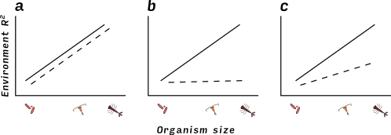

```{r echo=FALSE}
fig_nums <- captioner()
tab_nums <- captioner(prefix = "Table")
fig <- pryr::partial(fig_nums, display = "cite")
tab <- pryr::partial(tab_nums, display = "cite")
```

<!-- Abstract -->

## Introduction

One of the most profound differences between organisms is their body size. Large
and small organisms can differ in population size, growth rates, morphological
complexity, genome size, and modes of dispersal. This scaling of biological
processes with organism size has often been used to explain differences in the
spatial distribution of small and large organisms. Microscopic organisms such as
bacteria and plankton are often globally distributed, while larger
organisms have more geographically restricted distributions [@Fenchel2004]. Even
within landscapes, there is some evidence that the occurrence of such microscopic
organisms responds less to environmental gradients than larger organisms
[@Farjalla2012;@Fierer2011].  However, while such differences in distribution
suggest that the suite of processes underlying community assembly differ between
micro- and macroscopic organisms, it is difficult to determine which process is
driving this difference. There are at least two possible mechanisms that may
make communities of smaller organisms more widely distributed. First, smaller
organisms could have larger environmental tolerances, allowing them to occupy
broader fundamental niches. Second, smaller organisms could have greater
dispersal abilities, allowing them to reach more habitats.

Smaller organisms may have broader environmental tolerances for several reasons.
First, their small body size allows habitat heterogeneity to affect them at very
small scales:  smaller organisms are able to find tolerable microhabitats, while
organisms that experience the environment at a coarser grain may not detect a
similar variation in the environment. This biological difference between small
and large organisms can be compounded by the macroscopic grain at which
organisms are typically observed by researchers, which averages over any
microscopic-scale variation in distribution. Secondly, single- celled organisms
may be able to use multiple carbon sources [@Langenheder2007] and able to
survive in a greater range of habitats. Very small organisms are also more
likely to possess resting stages when a habitat is unfavorable (e.g. encysting
protists, tun state for tardigrades) or to propagate by a resistant life history
stage such as spores. At the population level, small organisms may persist in a
habitat if they are able to adapt to local conditions by virtue of their short
generation times and high population sizes. In the case of bacteria, genetic
adaptation can also involve the uptake and use of environmental DNA.

Alternatively, small organisms may be widely distributed because they are able
to get to more places faster. There is substantial evidence that microscopic
organisms such as bacteria, viruses, protists and plankton may be able to
disperse further than larger organisms; amongst these microscopic organisms, the
smallest disperse the furthest. The classic "everything is everywhere and the
environment selects" hypothesis of Baas Becking [-@BaasBecking1934] suggests
that smaller organisms are not limited by biogeographic barriers but instead are
found globally, emerging from resistant stages in favorable environments
[@Huszar2015]. Many bacteria and zooplankton have passive dispersal, traveling
long distances by wind or water currents, or by phoresy. In contrast, larger
animals (but not larger plants) usually have active dispersal; for example,
adult insects actively choose sites to oviposit. At the scale of landscapes, active
dispersal could result in a close association between distribution and
environmental variables, assuming that active dispersal is adapted to maximize
fitness. However, at continental and global scales, the limited distances covered by active
dispersers might prevent larger animals from reaching suitable places. This
would weaken the association between environment and distribution for larger
animals.

It has been difficult to determine whether differences in distribution between
small and large organisms is caused by differences in the strength of
environmental filtering or dispersal limitation. There are three reasons for
this. First, the distribution of micro-and macroscopic organisms has rarely been
compared within the same system. This creates a problem of scale, with studies
of many macroscopic organisms occurring on much smaller spatial scales than
those of microscopic organisms. Second, when we rely on observational data
alone, we have a limited ability to infer environmental filtering. This is
because environment, space and dispersal are often correlated. Previous
researchers have used variance partitioning to separate the effects of
environment from space, but this approach has limitations [@Gilbert2010]. For
example, Smith and Lundholm [-@Smith2010] found that spatially-correlated
dispersal contributed to both spatial and environmental partitions of variance
in community composition. Third, dispersal limitation and environmental filtering can mask each other. A species can only be filtered by a site’s environment when it can reach the site, so a community experiencing equally strong dispersal and environmental limitation can may show mainly the former in variance partitioning [@Smith2010; @DeBie2012a]. A special case of this problem occurs when an actively-dispersing species is not
found in a site. It is impossible to determine if this is because the environment
makes dispersal unlikely or establishment unlikely. <!--not clear: these confounding factors make observation of these patterns difficult; let's try experiment--> For example, an insect larva may be missing from a location because its parent was deterred from ovipositing in the environment or because the larvae could not withstand the environment. An
experiment that removes dispersal limitation for all organisms is therefore a
stronger test of the relative effects of environment on species composition. We
are aware of no study that experimentally removes dispersal limitation for both
micro- and macroscopic organisms in the same system, simultaneously, to reveal environmental filtering. We conducted such an experiment, here using bromeliad phytotelmata as a model community.

Here we provide a much stronger test<!-- than what?-- > of the strength of environmental filtering for these three organism types by experimentally dispersing all species to all habitats, and examining whether the original habitat-based patterns in composition re-emerged.  We predicted: 

1. If environmental filtering, but not dispersal limitation, increases with organism size, we would predict that habitat would affect the composition of communities of large-bodied organisms more than those of small-bodied organisms(`r fig("hypo")`a). <!--confusing: "before and after": deleted-->
2. If instead only dispersal limitation increased with organism size, we would expect that any apparent effect of habitat on community composition was an artifact of spatial autocorrelation and would be erased by our dispersal treatment (`r fig("hypo")`b). 
3. If both environmental filtering and dispersal limitation increased with organism size, we would predict an intermediate scenario (`r fig("hypo")`c).

## Study system 
<!--or maybe better: observational pattern?-->

Bromeliads are common in the Neotropics and contain many species of macroinvertebrates (especially insects [@Frank2009]),  zooplankton [@Petermann2015], and bacteria [@Haubrich2009a]. Importantly, different species of
bromeliad grow in different habitats, and this habitat variation is correlated with differences among their communities [@Marino2012]. Previous observations in this system
show that this environmental variation is closely associated with variation in
macroinvertebrate composition, weakly associated with variation in zooplankton communities and almost uncorrelated with variation in bacterial communities [@Farjalla2012].


<!--Can you add numbers to indicate their relative sizes, or their relationship to the threshold of interest (1mm)? -->

`r fig_nums("hypo", "Illustration of the possible patterns resulting from our experiment. Previous observations have already shown that community composition of larger animals is more strongly related to environmental differences than is composition of smaller organisms (solid line, all figures). In our experiment we remove differences among community composition, and observe the subsequent return of these differences as caused by environment (dashed lines). There are three possible outcomes. If differences in composition are caused by an increase in sensitivity to the environment (with increasing organism size), then we should see a match between the amount of environmental signal before and after the experiment (1a). If differences in composition are caused by biased dispersal, we should see no difference after the experiment (1b). Finally, an intermediate scenario (1c) results when both environment and biased dispersal contributed to the original pattern.")`

## Methods

### Experimental design

<!--interesting premise, needs figure? but what / how to do this-->
We performed this
experiment in the same location and along the same gradient of environmental
variation (bromeliad species in different habitats) as Farjalla et al. [-@Farjalla2012]. Both their study and ours took place in the Parque Nacional de Jurubatiba,
Northeast Rio de Janeiro state, Brazil ($22^{\circ}$ S $41^{\circ}$ W). The 
environmental gradient in this ecosystem is twofold -- three different species of bromeliad,
which grow in three levels of exposure to sunlight. Each species of bromeliad
is found in a different habitat: _Aechmea nudicaulis_ (full sun
habitats), _Vriesea neoglutinosa_ (partial shade), and _Neoregelia cruenta_
(full shade). _Neoregelia_ has a uniquely large habitat range at this site,
occurring in both full shade and full sun; only shade plants were used in this
study.

```{r}
str_end <- blocks %>% 
	filter(experiment == "threespp") %>% 
	select(setup.date) %>% 
	mutate(sdate = ymd(setup.date)) %>% 
	filter(sdate %in% range(sdate)) %>% 
	.[["sdate"]]
```

For each of five temporal blocks, we
collected and sampled the macroinvertebrates, zooplankton and bacteria of two
bromeliads of each of the three species. We then homogenized the communities
of all six bromeliads as described shortly (`r fig("design")`).  Our goal was
to create identical starting community composition for all bromeliads within a
block. Variation between blocks in starting community composition is thus
included in the random effect of blocks. We created five blocks in this
experiment between `r format(str_end[[1]], format = "%d %B %Y")` and `r format(str_end[[2]], format = "%d %B %Y")`.
<!--more and stronger statements of what animals we are studying and how big they are-->

 

`r fig_nums("design", "Schematic of our experimental design. We first sampled six bromeliads (two plants of each of three species). We formed (solid arrows) homogeneous initial communities (MIX) by counting equal numbers of animal taxa (macroinvertebrates) or by mixing water samples of equal volume from all plants (zooplankton and bacteria). We then returned (dashed arrows) these initial communities to the six bromeliads, and returned the bromeliads to their original habitats.")`

Our experimental setup consisted of three steps (`r fig("design")`):
collection of original communities from bromeliads, homogenization of
communities, and assembly of this homogenized community in each of the
original (now empty) bromeliads.  **Original communities**: We
sampled the zooplankton and bacteria communities by collecting water
samples from each bromeliad: 100ml for zooplankton, 50ml for bacteria.
Zooplankton were collected by filtering on 50 μm Nytex mesh and fixed
in 5% buffered formalin. This fixed solution was then diluted to 20
ml, and a 1 ml subsample taken for analysis. Zooplankton were
identified to the lowest taxonomic unit possible (species in most
cases, except for bdelloid rotifers and harpaticoid copepods, identified to class and order, respectively). Bacteria were collected
by taking 100ml of filtrate from the zooplankton sample and filtering
it a second time on a Whatman filter paper. We measured bacterial
community composition using denaturing gradient gel electrophoresis
(DGGE, Muyzer et al. [-@Muyzer1993]). This technique measures an approximation of
bacterial diversity in the form of Operational Taxonomic Units (OTUs). We sampled
macroinvertebrates by thoroughly rinsing each bromeliad and filtering
the water through 1mm and 180μm mesh. These mesh sizes have been shown
to separate macro invertebrates from both coarse detritus and fine
particulate organic matter, facilitating their collection
[@Romero2010]. We identified macroinvertebrates to morphospecies. 
**Homogenized communities**: We created homogenized communities of
zooplankton and microbes by mixing an equal volume of filtered tank
water from each of the six bromeliads in a block (approximately 100ml plant^-1^), then adding 
this mixture to all bromeliads. To create
homogenized communities of macroinvertebrates, we divided individuals  of all species equally among the six bromeliads in each block. **Bromeliad preparation**: We emptied
bromeliads by washing them thoroughly, hanging them upside down to dry
for at least 24 hours and then rinsing each plant with 70% ethanol.
Any coarse detritus found in the bromeliads was similarly cleaned,
frozen and thawed (to kill any macroinvertebrates eggs). We confirmed
that this technique removed all invertebrates and most detritus by
dissecting an empty bromeliad. Bromeliads were placed in a local
habitat similar to their original location: _Neoregelia_ in shade,
_Aechmea_ in full sun and _Vriesea_ in marginal habitat. We then added
the starting communities of macroinvertebrates, zooplankton and
bacteria.

Bromeliads are an open system, characterized by continual colonization and
emergence. Both of these processes are problematic for our question. If we
were to allow colonization it could swamp any changes in our starting
community composition. Conversely, if we allowed the experiment to continue
for too long any macroinvertebrates with complex life cycles would emerge,
leaving us with no community to sample [@Lecraw2014]. We took two steps to
make sure that our treatment effects were not affected by colonization or
excessive emergence. To prevent colonization we surrounded bromeliads with
mosquito netting (mesh size approx. 1.5 mm). To prevent emergence we ended our
experiment after 12 days, based on the results of a pilot study that
confirmed that this was sufficient time for communities to change, but not so
long that bromeliads were empty.


### Analyses

We distinguished between our three predictions `r fig("hypo")` with a
permutation ANOVA (PERMANOVA), which measures the amount of difference
in community composition between treatment groups and compares this to
the expected distribution under a null hypothesis of no treatment
effects. In each PERMANOVA we used block as an error stratum, meaning
that permutations were performed within blocks. We repeated this
analysis for all three organism types, and at both "initial" and
"final" sampling dates (i.e. at the beginning and end of the
experiment). We interpreted the R^2^ value of this PERMANOVA as a metric of the strength of habitat filtering (`r fig("hypo")`) 
<!--similar criterion and decision rules for the other hypotheses?-->

All statistical analyses were conducted in R 3.2.3 [@rcore] using vegan 2.3 [@vegan] and mvabund [@mvabund]. Code to reproduce the analysis published here is available at ***link to data***


## Results   
```{r echo = FALSE}
per_decline <- mean((disp_diffs$initial - disp_diffs$final)/disp_diffs$initial)
pdiff <- sprintf("%.0f", per_decline * 100)
gettime <- function(tax, .r2_plot_df){
  ans <- .r2_plot_df %>% 
    filter(taxa == tax)
  
  ret <- sprintf("%.2f", ans$number)
  names(ret) <- ans$time
  ret
}

# med_inv <- sprintf("%.0f", median(gettime("inverts", r2_plot_df)))
inv_r2 <- gettime("inverts", r2_plot_df) 
zoops_r2 <- gettime("zoops", r2_plot_df) 
bact_r2 <- gettime("bact", r2_plot_df) 
```

Bromeliad species identity explains more variation in community
composition of invertebrates, less for zooplankton and less still for
bacteria (`r fig("bw_spp")`, `r tab("perm_3sp")`. For all organism
types, bromeliad species explained less of the variation in
composition at the end of the experiment than at the beginning. Note
that though sampling design (and therefore degrees of freedom) are
identical for all groups, p-values below 0.05 are associated with different F-values in different groups. This is because p-values in PERMANOVA
are calculated on a null distribution generated by permuting samples
among groups (species in our case). Bacterial communities have many
species and also high similarity among communities (bromeliads),
creating a null distribution with low mean and small variance (and
hence lower thresholds for significance).

```{r nullmodelslope}
inises <- r2_null_test[[2]] %>% 
  filter(time == "ini") %>% 
  .[["ses"]] %>% 
  sprintf("%.2f", .)

inip <- r2_null_test[[2]] %>% 
  filter(time == "ini") %>% 
  .[["null_p"]]


finses <- r2_null_test[[2]] %>% 
  filter(time == "fin") %>% 
  .[["ses"]] %>% 
  sprintf("%.2f", .)

finp <- r2_null_test[[2]] %>% 
  filter(time == "fin") %>% 
  .[["null_p"]]

```


The pattern in `r fig("bw_spp")` may have also been caused by differences in the kind of data we used for each group. We therefore compared this pattern of increasing environmental effects with a null model. First, we calulated the slope of the relationship between R^2^ value and organism size (size was represented as ranks). We then generated null distributions by reshuffling bromeliad species within blocks. In these null simulations the same permutation was used for all organism types. We found that the observed slope was much higher than the null simulations for both initial (SES = `r inises`, p = `r inip`) and final (SES = `r finses`, p = `r finp`) sampling (`r r2_null_test[[1]] %>% length` simulations). 

```{r echo=FALSE}

extract_tab <- function(mglmtab, .term){
	mglmtab %>% 
 	 filter(term == .term) %>% 
 	 .[["Dev"]] %>% 
 	 sprintf("%.2f", .)
}

inverts_interact <- extract_tab(inverts_manyglm_table, "Block:species")
zoops_interact <- extract_tab(zoops_manyglm_table, "Block:species")
bact_interact <- extract_tab(bact_manyglm_table, "Block:species")
```


### Tables	

```{r echo=FALSE}
getF <- function(x) sprintf("%.2f", x[["aov.tab"]][["F.Model"]][[1]])
getP <- function(x) x[["aov.tab"]][["Pr(>F)"]][[1]]
getR <- function(x) sprintf("%.2f", x[["aov.tab"]][["R2"]][[1]])
```

`r tab_nums("perm_3sp", "Bromeliad species effects on the composition of three types of organisms, as determined by PERMANOVAs both before and 12 days after homogenization. Both F-ratios and R^2^ values are higher for macroinvertebrates than for zooplankton than for bacteria (before and after). Following homogenization, macroinvertebrate and bacterial communities both significantly diverged among bromeliad species.")`

|                    |        | F~2,27~                            | p                            | R^2^                         |
| -------- | ------------------| ---------|--------- | ---------- |
| macroinvertebrates | before | `r getF(inverts_adonis_ini)` | `r getP(inverts_adonis_ini)` | `r getR(inverts_adonis_ini)` |
|                    | after  | `r getF(inverts_adonis_fin)` | `r getP(inverts_adonis_fin)` | `r getR(inverts_adonis_fin)` |
| zooplankton        | before | `r getF(zoops_adonis_ini)` | `r getP(zoops_adonis_ini)` | `r getR(zoops_adonis_ini)` |
|                    | after  | `r getF(zoops_adonis_fin)` | `r getP(zoops_adonis_fin)` | `r getR(zoops_adonis_fin)` |
| bacteria           | before | `r getF(bact_adonis_ini)` | `r getP(bact_adonis_ini)` | `r getR(bact_adonis_ini)` |
|                    | after  | `r getF(bact_adonis_fin)` | `r getP(bact_adonis_fin)` | `r getR(bact_adonis_fin)`                             |


### Figures


`r fig_nums("bw_spp", "The amount of variation (r2 from PERMANOVA) in faunal community composition explained by bromeliad species (i.e. the strength of the environmental signal) decreases from larger to smaller organisms.  The environmental signal in initial, undisturbed communities was removed by homogenization, but after 12 days of recovery, was again of similar strength in final macroinvertebrate and bacterial communities. ")`

<!-- add the sizes of the groups -->

## Discussion

## Main findings

Our study compared the response of macroinvertebrates, zooplankton and
bacterial communities to identical environmental gradients. Our initial sampling prior to the experimental manipulation found that the correlation between environment
and community composition is weaker for bacteria, intermediate for
zooplankton, and strong for macroinvertebrates (`r fig("bw_spp"`). This observational pattern mirrors that previously reported by Farjalla et al. [-@Farjalla2012],  confirming that the observational pattern is robust to differences in field site and year.<!--show this?!--> However, this observed pattern may have been caused by differences among the three organism types in the strength of environmental filtering or environmentally-correlated dispersal, or
both (`r fig("hypo")`). We
therefore removed dispersal limitation among communities by homogenizing our
starting communities, but returned communities to the same environmental gradient to test whether pure environmental filtering was sufficient to restore the initial pattern in distributions. Our results are most consistent with environmental filtering increasing
with organism size (Fig 1a). Specifically, we found that the
environment created large differences in macroinvertebrates, weaker
differences in zooplankton, and none in bacteria (`r fig("bw_spp")`).

Our experimental manipulation suggests that environmental filtering is stronger
for larger than smaller organisms, and that this explains the differences
observed in the field between organismal groups. An increase in environmental
filtering with body size is most simply explained as a contraction in the
breadth of the fundamental of organisms contracts as their body size increases.
Farjalla et al. [-@Farjalla2012] termed this hypothesis the "size-plasticity
hypothesis" and, like us, related it to differences in the distribution of
bacteria, zooplankton and macroinvertebrates between bromeliads. Studies of
other groups of organisms across environmental gradients within landscapes also
show the same pattern of increasing environmental determinism with body size.
For example, along mountainsides, elevation explains more variation in plant
diversity than in bacteria [@Bryant2008]. In streams, environmental variation
also correlates more strongly with stream invertebrate than bacterial
composition [@Wang2012a]. Similar patterns are also found in a group of Finnish
lakes, where Soininen et al. [-@Soininen2013] analyzed the distribution of
individual taxa rather than organism groups. They found that models describing
the distribution of taxa in terms of the environment had greater predictive
power for zooplankton than phytoplankton than bacteria.

Interestingly, while this pattern of increasing environmental determinism with
body size is found frequently when multiple groups are compared along the same
small environmental gradient, this effect can be absent (or even reversed)
between studies or along regional spatial scales. In a meta-analysis of 326
studies<!-- from around the world? --> covering a broad range of ecosystems and
taxa, neither body size nor dispersal ability predicted the  strength of
environment filtering for individual species [@Soininen2014]. For example, a
study comparing various freshwater groups across all of Belgium found that
passively-dispersed organisms with larger propagules showed _less_ environmental
signal, probably because increased dispersal limitation masked the signal of
environmental filtering [@DeBie2012a]. The contrast between the results of this
regional study and smaller-scale studies suggests that the choice of spatial
scale is of critical importance, a point we return to later.

## Caveat 1: species interactions

Although the direct effect of the environment on organisms is the simplest
explanation for our results, we cannot discount indirect effects of the
environment that are mediated by species interactions. For example, if a
predator only occurs in environment A and not B, then its prey may be restricted
to environment B even if the prey’s fundamental niche includes both
environments. More subtly, the predator may occur in environment A and B, but
have the strongest consumption rate of prey in environment A, causing a similar
pattern of the prey species appearing to be restricted to environment B. In
either case, the resulting pattern could be misinterpreted to mean that only
environment B is included in the fundamental niche of the prey species. 

Such effects of species interactions on species distributions cannot be excluded
in this study. For example, in bromeliads, consumption rates of damselflies may
be reduced by high detrital density [@Klecka2014;@Srivastava2006a]; that is, in
_Aechmea_ (open habitats, less detritus) bromeliads as compared to _Neoregelia_
(closed habitats, more detritus) bromeliads.  As predators can show preference
for different prey (Chapter 2), differences in macroinvertebrate composition
between these two bromeliad species could be more related to top-down effects
than environmental tolerances _per se_.

More generally, species interactions besides predation may also shift over
environmental gradients. For example, interactions within a trophic level can
shift between strongly competitive and facilitative as environments become more
stressful [@He2014a]. The strength of species interactions may also change
between different organism groups [@Soininen2013]. For example, it has been
suggested that bacterial communities have weak, diffuse interactions because of
their high diversity [@Wang]. If so, bacterial communities would show diminished
potential for species interactions to mediate the  effects of the environment.

Many multivariate studies have the same problem of confounding direct effects of
the environment on communities with the indirect effects mediated by species
interactions [@Vellend2014]. In our study, the empirical solution of
transplanting species individually would have been logistically difficult in the
case of the macroinverterbrates (`r ncol(inverts_tts_ini$taxa)` species) and impossible in the case of
bacteria. Instead, we interpret our results as representing the inclusive
effects of environmental filtering, that is, both the direct and indirect
effects of the environment on organisms.

<!-- Secondly, the environment can determine the presence of a strongly-interacting
species, which in turn determines the presence of other animals. This can occur,
for example, with the damselfly _Leptagrion andromache_, which like other
bromeliad-dwelling odonates is only found in large bromeliads which are safe
from drought [@Marino2012;@Srivastava2005]. This environmental effect on
damselfly distribution can cascade to other species, because many actively-
dispersing macroinvertebrates avoid bromeliads with odonates
[@Marino2015;@Hammill2015]. While variation from active dispersal does not
account for the variation we saw at the end of the experiment (since we removed
all dispersal limitation), our original observations contain this effect. -->

## Caveat 2: Other correlates of body size

There are many ecological processes, besides fundamental niche breadth, that may
be different for groups of smaller organisms. We examined three groups of
organisms that also differed in terms of dispersal mode (active:
macroinvertebrates; passive: zooplankton, bacteria), detectability 
(macroscopic: macroinvertebrates; macroscopic: zooplankton, bacteria), abundance
(high: bacteria; intermediate: zooplankton; low: macroinvertebrates) and life
cycle (complex life cycles: most macroinvertebrates, simple life cycles:
zooplankton, bacteria). Of these potentially confounding differences, we can
immediately discount any effects of active versus passive dispersal as our
experimental manipulation removed all dispersal. We now show that the other
three differences are unlikely to have resulted in the observed signal of
environmental filtering between organism groups.

Our three organism types were identified with very different procedures,
depending on their size: the macroinvertebrates and zooplankton could be
visually identified to morphospecies whereas the bacteria were assigned to
genetically distinct groups using DGGE, which cannot distinguish between
closely-related taxa [@Wiedenbeck2011]. If environmental filtering in bacteria occurred largely at
these low taxonomic levels, we might have underestimated the strength of
environmental filtering for bacteria. However, another study of bromeliad
bacteria in a nearby restinga, which used the higher-resolution method of
metagenomics sequencing to identify bacteria, also found no evidence of sorting
according to taxonomy – but strong sorting in terms of sorting in terms of
phylogenetically-labile functional traits (S. Louca et al. unpubl. results).
Together, these results suggest that within coarse functional groups, bacterial
taxa are largely substitutable.

The three groups of organisms also differed in abundance per species, from as
low as a single individual per species in the case of rare macroinvertebrates to
many millions of individuals for abundant bacteria taxa. Ecological drift – the
variation in species composition caused by the stochastic sequence of births and
deaths - should be strongest therefore for macroinvertebrates and zooplankton,
countering the deterministic signal of environmental filtering (`r
fig("hypo")`b). Nevertheless, we still observed the strongest environmental
effects on macroinvertebrates and zooplankton, suggesting that our results are
robust to any effects of drift.

Finally, the three organism groups differed in terms of life cycle complexity:
our experiment captures part of the complex life cycle of many invertebrates
(i.e. the larval stage of insects) and the full simple life cycle for other taxa
(including zooplankton and bacteria and some invertebrates, such as
oligochaetes). Thus we have two ways for environmental filtering to act: via
larval mortality on complex life cycles, and via both mortality and fecundity on
simple life cycles. This means that there is less potential for change in
relative abundance for (most) macroinvertebrates than for zooplankton or
bacteria. Despite this numerical constraint, we found that the effect of the
environment was strongest on macroinvertebrates, and weakest on bacteria.

### Extending the experimental approach

Our experiment occurred over a short temporal and small spatial scales. While
this tells us about the immediate impact that local variation in the environment
had on each group, it does not let us examine the interplay between recovery
time, spatial scale and the environment. Transient dynamics are a ubiquitous
part of community assembly, and patterns seen at short time scales may not
reflect the long-term composition of communities [@Drake1990]. Similarly, as the
spatial scale increases, both dispersal limitation and environmental differences
are expected to increase in importance, so it is an open question whether the
differences between organism groups that we identified will scale up
[@DeBie2012a]. Now that we have established the efficacy of our experimental
design, it could easily be extended to cover different temporal and spatial
scales to address these points. For most systems, measuring the temporal
dynamics for multiple groups at once across large spatial scales is too
difficult; however, this could be possible in a small, naturally patchy system
like ours. Such cross-scale experimental studies are a necessary step to unify
the variable results obtained by observational studies of environmental
determinism.

In conclusion, we have demonstrated in a manipulative experiment an
environmental filtering mechanism behind a organism size pattern that has
previously been observed in many systems and at many spatial scales. To our
knowledge, this is the first experimental test of such a mechanism within a
single system. The success of this approach suggests extensions of this design
to other proposed mechanisms underlying community structure. This will help
unify the contrasting results of environmental differences on organisms of
different size, and lead to an understanding of how body size influences the
process of community assembly.

## References
