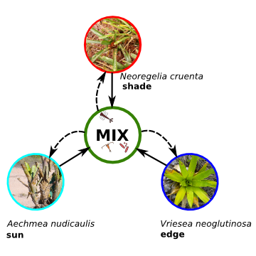

## Abstract

## Introduction

### Composition and the environment 

When can we predict species composition from environmental conditions? This
relationship is important to understand, because different species
compositions may perform different functions. If different environments cause different species compositions, then as the global environment changes, species will also change [CITE]. However, it appears that 
not all species, or groups of species, are equally sensitive to the same environmental gradient. Are there
general principles which would allow us to predict when species composition
depends on the environment? In this chapter, we test the hypothesis that the
strength of this relationship is positively correlated with the overall size
of organisms, with a stronger signal of environmental variation in larger-
bodied macroscopic organisms, and a weaker signal in smaller-bodied
microscopic organisms.

How much variation in community composition is related to the environment
depends on the process of community assembly. Models of community assembly
describe how local communities are assembled from the regional species pool;
these have been organized by Vellend [Vellendblahblah;Nemergut2013a] into four
distinct processes: speciation, dispersal, selection and drift. In this
framework, speciation populates the regional pool, dispersal refers to the
arrival of species into a local community, “selection” to differences among
species in their response to environment or other species, and “drift” to
changes in species abundances resulting from stochastic demographic processes.
These four processes together can describe all of the contemporary models of
community ecology. For example, neutral theory assumes all individuals of all
species are equivalent, and so is based on dispersal, drift and speciation
alone. Because neutral theory excludes ecological selection, it predicts that
spatial patterns in species composition are largely uncorrelated with the
underlying environment. In a niche-based framework, species are able to
coexist if they possess traits which permit them to colonize and persist in a
habitat, and if they are sufficiently different from other species to allow
coexistence. Because species often differentiate their niches on the basis of
environmental tolerance, niche theories generally predict a close coupling of
species composition with the underlying environment (although note that this
interpretation sidelines the importance of species interactions in ecological
selection: Vellend et al. 2014).

As neutral and niche theory make different predictions about the strength of
environmental correlations with species composition, numerous studies have
examined such correlations in the hopes of determining whether niche or
neutral paradigms are the better descriptor of communities. Rather than a
universal pattern, such studies have instead revealed a wide spectrum of
correlation strengths between environment and communities. Although there has
been some attempt to understand this variation in terms of differences between
environments (Cottenie), there has been much less consideration of the role of
biological differences between organisms.

One of the most profound differences between organisms is in their body size.
Macroscopic (> 1mm) and microscopic (< 1 mm) animals differ in population
size, population growth rates, physiological pathways, morphological
complexity, genome size, mechanisms of gene transfer, and modes of dispersal.
These biological properties of organisms are in turn expected to affect rates
of speciation, dispersal, selection and drift -- the four processes underlying
community assembly. It is therefore likely that communities composed of
either macroscopic and microscopic animals differ in the way in which they are
assembled.

If microscopic and macroscopic communities are assembled by different
processes, we would expect to see difference in their distribution. Indeed,
this is often the case. Microscopic organisms are often globally distributed,
while macroscopic organisms have more geographically restricted distributions.
Even within landscapes, there is some evidence that microscopics organisms
respond less to environmental or elevational gradients than macroscopic
organisms (Farjalla, Fierer et al 2011 ecology).  However, while such
differences in distribution suggest that the suite of processes underlying
community assembly differ between micro- and macroscopic organisms, it is
difficult to determine which process is driving this difference. There are two
possible mechanisms that may make communities of smaller organisms more widely
distributed. First, smaller organisms could have larger environmental
tolerances, allowing them to occupy broader fundamental niches. Second,
smaller organisms could have greater dispersal abilities, allowing them to
reach more habitats.

<!--Bryant J et al 2008 pnas show bacteria and plants have different patterns over an elevational gradient – but both respond-->
<!--Wang, J., Soininen, J., Zhang, Y., Wang, B., Yang, X. and Shen, J. (2012), Patterns of elevational beta diversity in micro- and macroorganisms. Global Ecology and Biogeography, 21: 743–750. doi: 10.1111/j.1466-8238.2011.00718.x-->
<!--[@Huszar2015]-->

### Macroscopic organisms and microscopic organisms show different patterns of distribution -- plasticity

The environment may not affect small-bodied organisms if they have large
fundamental niches, meaning that they would not experience much selection
after colonizing a new habitat. This larger fundamental niche could be caused
by several factors. First, their small body size allows habitat heterogeneity
to affect them at very small scales:  smaller things are able to find tiny
microhabitats that they are able to tolerate, while organisms that live at
larger scales cannot. Secondly, smaller organisms may have a simpler
metabolism (especially in the case of very small organisms) with fewer tissues
and fewer dietary requirements.  This leads to a wide dietary plasticity --
for example, a single bacteria taxon can often consume a wide variety of
carbon sources. Microscopic life is also more likely to possess resting stages
when a habitat is unfavorable (e.g. encysting protists, tun state for
tardigrades) or to propagate by a resistant life history stage (spores). At
the population level, small organisms may persist in a habitat if they are
able to evolve rapidly by virtue of their rapid generation times and high
population sizes. This rapid evolution can also proceed because of the use of environmental DNA, which bacteria can absorb and which may confer an advantage in new habitats. Zooplankton may also
evolve rapidly (cite), for example in response to the presence of predators.

#Explanation 2:   Alternatively, microscopic organisms may be widely
distributed because they are able to get to more places faster. There is
substantial evidence that microscopic organisms may be able to disperse
further than macroscopic organisms. The classic "everything is everywhere and
the environment selects" hypothesis of [cite] suggests that smaller organisms
are not limited by biogeographic barriers but instead are found everywhere,
emerging from resistant stages in favorable environments. Many bacteria and
zooplankton have passive dispersal, traveling between suitable habitat by wind
or water currents, or by phoresy. In contrast, macroscopic organisms usually
have active dispersal, for example oviposition by flying adults. At smaller
spatial scales, active dispersal could result in a close association between
distribution and environmental variables, assuming that active dispersal is
adapted to maximize fitness. However, at larger scales, the limited distances
covered by active dispersal might prevent macroscopic animals from reaching
suitable places. This would weaken the association between environment and
distribution for such animals. Dispersal is higher for smaller animals both in
terms of the number of dispersing propagules (because population sizes are so
much larger) and the distance dispersed (since passive dispersal requires no
energy, organisms can go very far.)

It has been difficult to determine whether environmental filtering or
dispersal limitation explains variation in species composition between micro-
and macroscopic organisms. There are two reasons for this. First, the
distribution of micro-and macroscopic organisms has rarely been compared
within the same system. This creates a problem of scale, with studies of many
macroscopic organisms occurring on much smaller spatial scales than bacteria.
Second, when we rely on observational data alone, we have a limited ability to
infer environmental filtering. This is because environment, space and
dispersal are often correlated. Additionally, when an actively-dispersing
species is not found in a site it is impossible to determine if this is
because the environment makes dispersal or establishment unlikely. For
example, a female insect may be deterred from ovipositing in a location by the
presence of a predator. Previous researchers have used variance partitoning to
separate the effects of environment from space, but this approach still has
limitations [CITE]. Patterns of dispersal may be irregular and nonlinear over space,
caused by individual behaviour (active dispersers) or by nonlinear,
unpredictable vectors (passive dispersers). An experiment that removes
dispersal limitation for all groups is a stronger test of the relative effects
of environment on species composition. We are aware of no study that
experimentally removes dispersal limitation for both micro- and macro-
organisms in the same system, simultaneously.

#Bromeliads 
We conducted an experiment that removes dispersal limitation for
micro- and macro-organisms, using bromeliad phytotelmata as a model community.
Bromeliads are beautiful plants that come from the neotropics. they're quite
nice and everyone likes them. they are full of animals, and they are complex
ecosystems in their own right. Most importantly for us, different species of
bromeliad grow in different habitats. Previous observations in this system
show that this environmental variation is closely associated with variation in
macroinvertebrate composition, weakly associated with variation in zooplankton communities and not at all associated with variation in bacterial communities (Farjalla et al.).

#Hypotheses
Here we provide a much stronger test of the strength of environmental filtering for these three organism groups by experimentally dispersing all species to all habitats, and examining whether the original habitat-based patterns in composition re-emerged.  We predicted: 
1). If environmental filtering increases with organism size, we would predict that larger organisms would show stronger habitat effects on community composition than smaller organisms, both before and after our experimental dispersal treatment (Fig. 1a). 
2). If instead dispersal limitation increased with organism size, we would expect that any apparent effect of habitat on community composition was an artefact of spatial autocorrelation and would be erased by our dispersal treatment (Fig. 1b). 
3). If both environmental filtering and dispersal limitation increased with organism size, we would predict an intermediate scenario (Fig. 1c).

## Methods

### Experimental design

Our goal is to experimentally test the observational patterns
documented by Farjalla et al. [-@Farjalla2012], therefore we performed this
experiment in the same location along the same gradient of environmental
variation. The location we used is the Parque Nacional de Jurubatiba,
Northeast Rio de Janeiro state, Brazil ($22^{\circ}$ S $41^{\circ}$); the
environmental gradient is twofold -- three different species of bromeliad,
which grow in three levels of exposure to sunlight. Each species of bromeliad
is found in a different habitat of the park: _Aechmea nudicaulis_ (full sun
habitats), _Vriesea neoglutinosa_ (partial shade), and _Neoregelia cruenta_
(full shade). _Neoregelia_ has a uniquely large habitat range at this site,
occurring in both full shade and full sun; only shade plants were used in this
study.

We homogenized the community of macroinvertebrates, zooplankton and bacteria
among all three bromeliad species. For each of five temporal blocks, we
collected and sampled the macroinvertebrates, zooplankton and bacteria of two
bromeliads of each of the three species. We then homogenized the communities
of all six bromeliads as described shortly (Figure  1).  Our goal was
to create identical starting community composition for all bromeliads within a
block. Variation between blocks in starting community composition is thus
included in the random effect of blocks. We created five blocks in this
experiment between 27 March 2013 and 03 April 2013.

 

Figure  1: Schematic of our experimental design. We first sampled six bromeliads (two plants of each of the three species named here). We formed (solid arrows) homogeneous initial communities (MIX) by counting equal numbers of animals (macroinvertebrates) or by mixing water samples of equal volume from all plants (zooplankton and bacteria). We then returned (dashed arrows) these initial communities to the six bromeliads, and replaced the bromeliads in their original habitats.

Our experimental setup consisted of three steps (Figure  1):
collection of original communities from bromeliads, homogenization of
communities, and assembly of this homogenized community in each of the
original (now empty) bromeliads.  **Original communities**: Prior to sampling
the macroinvertebrates, we sampled macroinvertebrates by thoroughly rinsing
each bromeliad and filtering the water through 1mm and 180μm mesh. These mesh
sizes have been shown to separate macro invertebrates from both coarse
detritus and fine particulate organic matter, facilitating their collection.
We identified macroinvertebrates to morphospecies. We sampled the zooplankton
and bacteria communities by collecting water samples from each bromeliad:
100ml for zooplankton, 50ml for bacteria. Zooplankton were collected by
filtering on 50 μm Nytex mesh and fixed in 5% buffered formalin. This fixed
solution was then diluted to 20 ml, and a 1 ml subsample taken for analysis.
Zooplankton were  identified to the lowest taxonomic unit possible (species in
most cases, except for bdelloid rotifers and harpaticoid copepods, left at the
level of class and order, respectively). Bacteria were collected by taking
some of the filtrate from the zooplankton sample and filtering it a second
time on a Whatman filter paper. We measured bacterial community composition
using denaturing gradient gel electrophoresis (DGGE, Muyzer et al.
[@Muyzer1993]). This technique measures an approximation of bacterial
diversity in the form of Operational Taxonomic Units (OTUs). **Homogenized
communities**: We created homogenized communities of zooplankton and microbes
by mixing an equal volume of filtered tank water from each plant
(approximately 100ml plant^-1^), then dividing this mixed volume among all
individual bromeliads. To create homogenized communities of
macroinvertebrates, we simply divided all the individuals of all species found
in our six bromeliads equally among these bromeliads. **Bromeliad
preparation**: We emptied bromeliads by washing them thoroughly, hanging them
upside down to dry for at least 24 hours and then rinsing each plant with 70%
ethanol. Any coarse detritus found in the bromeliads was similarly cleaned,
frozen and thawed (to kill any macroinvertebrates eggs). We confirmed that
this technique removed all invertebrates and most detritus by dissecting an
empty bromeliad. Bromeliads were placed in a local habitat similar to their
original location: _Neoregelica_ in shade, _Aechmea_ in full sun and _Vriesea_ in
marginal habitat. We then added the starting communities of
macroinvertebrates, zooplankton and bacteria.

Bromeliads are an open system, characterized by continual colonization and
emergence. Both of these processes are problematic for our question. If we
were to allow colonization it could swamp any changes in our starting
community composition. Conversely, if we allowed the experiment to continue
for too long any macroinvertebrates with complex life cycles would emerge,
leaving us with no community to sample [@Lecraw2014]. We took two steps to
make sure that our treatment effects were not affected by colonization or
excessive emergence. To prevent colonization we surrounded bromeliads with
mosquito netting (mesh size approx. 1.5 mm). To prevent emergence we ended our
experiment after 12 days, based on the results of a pilot study that
confirmed that this was sufficient time for communities to change, but not so
long that bromeliads were empty.

### Analyses

*Question 1: less beta diversity among smaller organism types* 
If smaller taxa have broader fundamental niches, we should see less variation in community composition among
bromeliads for smaller organism types. That is, we should see less beta
diversity among bromeliads at the end of the experiment (following community homogenization) than we saw at the
beginning. We tested this by calculating multivariate dispersions
[@Anderson2006] between all six bromeliads (i.e. distances to centroid of all
bromeliads within one block) before and after the experiment. We repeated this
comparison for all five blocks, and for all three organism types. We used the
`betadisper` function in the R package vegan [@vegan], which provides a
permutation test to test for differences in dispersion before and after the
experiment within each block (999 null simulations block^-1^). For the
purposes of this analysis, we used the Raup-Crick measure of dissimilarity. We
extracted the mean distance to centroid (Figure  2) for each block
before and after the experiment. We did this because our hypothesis concerns
an interaction: specifically, that the effects of homogenization and recovery on mean distance to centroid
(i.e. the slopes of lines in Figure  2) declines with decreasing organism
size. This allowed us to test these differences with a mixed effect linear
model including the main effect of sampling time (before and after) organism
type (macroinvertebrate, zooplankton and bacteria) and their interaction, with
a random effect for block.

*Question 2: less environmental signal among smaller organism types* 
The size-plasticity hypothesis predicts that the correlation between community composition and environment should increase in strength from small to large types of organism.  This correlation should be weaker for smaller groups.
We tested this hypothesis with a permutation ANOVA (PERMANOVA), which measures
the amount of difference in community composition between treatment groups and
compares this to the expected distribution under a null hypothesis of no
treatment effects. In each PERMANOVA we used block as an error stratum,
meaning that permutations were performed within blocks. We repeated this
analysis for all three organism groups, and at both "initial" and "final"
sampling dates (i.e. at the beginning and end of the experiment).

*Question 3: Particular traits are correlated with environmental signal*

The distance-based approaches described above test the response of the whole
community, but community-level responses are often driven by the response of a
smaller number of species. These species often possess particular traits which
correlate with their responses. We tested this hypothesis with multivariate
generalized linear models [@mvabund], which is a  model-based multivariate
alternative to distance-based methods [@Warton2012]. This technique is implemented in the R package `mvabund`  [@Wang2012; @mvabund]. We used this approach to fit the model:

$log(\mu_{jkl}) =  intercept_{j} + block_{jk} + bromeliad_{jl} + block \times bromeliad_{jkl}$

where $\mu_{jkl}$ is the response of species $j$ in block $k$ to the environment of bromeliad $l$. This model is used to predict the mean of a negative binomial distribution: 

$Y_{ij} \sim NegBin(\mu_{jkl}, \phi_{j})$

Here, $Y_{ij}$ is the abundance of species $j$ in plant $i$. The dispersion parameter, $\phi_{j}$, measures the variability of species $j$ (constant across sites). We fit these models to final community composition only.

This approach has three advantages that make it suitable for our application.
First, because it is based on GLMs, we are able to model the mean-variance
relationship common in count data. This characteristic of count data is often
problematic for distance-based metrics, which can conflate differences in
dispersion with differences in location [@Warton2012]. We are already testing
for dispersion and location effects in the separate analysis described above
with distance based methods. Therefore this multivariate GLM approach helps
confirm our findings by accounting for both within a different framework.
Second, because it is model-based, it allows us to test for an interaction
between our treatments (different bromeliad species) and blocks. Significance
in these tests is generated by permutation tests based on 1000 replications.
Third, mvabund also allows for estimating individual species-level responses, via a correction for repeated family-level testing [@Wang2012].
This lets us identify which species responded most to the environmental
differences, and to relate these to traits of these species. 

All statistical analyses were conducted in R [@rcore]. Code to reproduce the analysis published here is available at ***link to data***

## Results   

*Question 1: less beta diversity among smaller organism types*
All organism groups showed the same decrease in mean distance to centroid at the end of the experiment -- there was no significant interaction between organism type and the effect of sampling time (Figure  2, Mixed effect model F~2,20~ = 0.44, p > 0.05). However, we did see an overall 22% decrease in the dispersion at the end of the experiment (F~1,20~ = 15.47, p < 0.05).

*Question 2: less environmental signal among smaller organism types*
Bromeliad species identity explains more variation in community composition of invertebrates, less for zooplankton and less still for bacteria (Figure  3: , Table  1. Similar to the dispersion result, we found that for all organism types, bromeliad species explained less of the variation in composition at the end of the experiment than at the beginning.

*Question 3: Particular traits are correlated with environmental signal*

We wanted to use the manyglm approach to measure test if smaller organism
types respond less to the same environmental gradient than larger ones. To do
this, we measured the percent of the total deviance explained by the
combination of $bromeliad_{jl}$ and $block \times bromeliad_{jkl}$ terms in
our model. These terms explained high proportions of deviance for insects and
zooplankton (71.38 and 69.72, respectively) and less for bacteria (24.17). This agrees with our hypothesis, and
with the PERMANOVA results reported above. We were obliged to combine terms
for this comparison, because there was always a significant interaction between
block and species in our models (ie, we could not examine main effects of
species independently; See Supplementary Material).

### Tables	

Table  1: Bromeliad species effects on the composition of three groups of organisms, as determined by PERMANOVAs both before and 12 days after homogenization. Both F-ratios and R^2^ values are higher for macroinvertebrates than for zooplankton than for bacteria (before and after). Following homogenization, macroinvertebrate and bacterial communities both significantly diverged between bromeliad species. 

|                    |        | F                            | p                            | R^2^                         |
| -------- | ------------------| ---------|--------- | ---------- |
| macroinvertebrates | before | 7.03 | 0.001 | 0.34 |
|                    | after  | 6.42 | 0.001 | 0.32 |
| zooplankton        | before | 2.59 | 0.008 | 0.16 |
|                    | after  | 1.75 | 0.125 | 0.11 |
| bacteria           | before | 0.69 | 0.101 | 0.05 |
|                    | after  | 0.63 | 0.016 | 0.04                             |

### Figures

Figure  2: Mean distance to centroid, before and after the experiment, for each of the three organism types. Each dot represents the mean distance to centroid for all six bromeliads in a block, and lines connect initial and final measurements of the same block.

Figure  3: The amount of variation (r2 from PERMANOVA) in faunal community composition explained by bromeliad species (i.e. the strength of the environmental signal) decreases from larger to smaller organisms.  The environmental signal in initial, undisturbed communities was removed by homogenization, but after 12 days of recovery, was again of similar strength in final macroinvertebrate and bacterial communities. 

Figure  4: Responses of individual species (or OTUs) to environmental variation. The percent of total deviance explained by each species is shown on the y-axis. Points are shaded if the adjusted p-value for that species regression was significant.

## Discussion

We tested three predictions of the size-plasticity hypothesis. First, we
tested whether smaller organism types would show less variation than larger
organisms (Question 1). We did not find support for this pattern. Second, we
asked whether smaller organisms showed a weaker relationship to environmental
variation than larger organisms (Question 2). We found this pattern in two
different multivariate tests (Question 3). Third, we asked which taxa were
driving the response, and found that chironomids, oligochaetes and one
zooplankton species in particular explained more of the deviance in
multivariate response.
<!-- That is the result. Now somewhere you need to talk about the explanation
for these taxa driving the trend. Looks like they were the only ones
abundant enough to be sig.  And –watch out! – oligochaetes are not active
dispersers. In the Farjalla et al. paper we were asked to do the analyses
with and without non-insects (oligochaetes and ostracods) to figure out
their influence. -->

We found that dispersion, in all cases, was lower at the end of the experiment
than at the beginning. This indicates that our treatments were effective in
homogeneous (or nearly-homogeneous) starting communities. This is important,
because it demonstrates that our inability to detect a species effect in
PERMANOVAs of bacteria does not reflect an inability to detect differences
among bacterial communities. However, the amount of this decline was the same
across all organism groups as indicated by the absence of a significant
interaction (Table  2). However, this method assumes that
homogenization occurred for all communities to the same degree. This is
unlikely to be the case: though we were able to count and precisely calculate
the starting insect community composition, we were obliged to use random
subsamples of the zooplankton and bacteria communities. This means that while
all communities began with the same invertebrate composition, they probably
began with slight variation in zooplankton and bacteria composition.

We did discover that, before and after the dispersal treatment,  the strength
of the environmental signal followed the pattern expected by the size-
plasticity hypothesis: macroinvertebrates > zooplankton > bacteria. The
results from the PERMANOVA test closely matched the order of magnitude and
rank order after the experiment as before. We found slightly different results
from the multivariate GLM approach: while macroinvertebrates still showed a
large response to environment and bacteria a small response, zooplankton
showed a response nearly as strong as for insects. One explanation for this is
that in creating global dispersal, we have removed the environmental signal
from active dispersal for insects (which may base oviposition decisions in
response to the environment). Our results are also consistent with those of
Soininen et al. [-@Soininen2013], who found a similar negative correlation
between organism size and environmental signal (in their case, zooplankton,
phytoplankton and zooplankton). Interestingly, they used a different
statistical framework: large-scale species distribution models instead of
local observations or experiments. As Farjalla et al. predicted, the strength
of environmental filtering is in negative proportion to body size. Over the
same time interval, insects and zooplankton developed more of a response to
the environment than did bacteria.

We have confirmed a hypothesis made by observational methods with a
manipulative experiment and a complementary statistical approach. In our
experiment we removed the variation in community composition between habitats,
and were essentially able to watch the recovery of beta diversity in our
system.  Our results offer support for the size plasticity hypothesis, and
offer insight into the development of beta diversity in three different groups
of organisms.

## References
