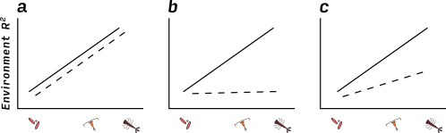

## Abstract

## Introduction

One of the most profound differences between organisms is in their body size.
Macroscopic (> 1mm) and microscopic (< 1 mm) animals differ in population size,
population growth rates, physiological pathways, morphological complexity,
genome size, mechanisms of gene transfer, and modes of dispersal. These
biological properties of organisms are in turn expected to affect rates of
speciation, dispersal, selection and drift -- the four processes underlying
community assembly. In this framework, speciation populates the regional pool,
dispersal refers to the arrival of species into a local community, “selection”
to differences among species in their response to environment or other species,
and “drift” to changes in species abundances resulting from stochastic
demographic processes. These four processes together can describe all of the
contemporary models of community ecology; providing a framework for assessing
whether differences in dispersal or differences in selection drive community
structure [@Vellend2010b;@Hanson2012;@Chase2011]. It is therefore likely that
communities composed of either macroscopic and microscopic animals differ in the
way in which they are assembled.

If microscopic and macroscopic communities are assembled by different processes,
we would expect to see difference in their distribution. Indeed, this is often
the case. Microscopic organisms are often globally distributed, while
macroscopic organisms have more geographically restricted distributions. Even
within landscapes, there is some evidence that microscopics organisms respond
less to environmental or elevational gradients than macroscopic organisms
[@Farjalla2012;@Fierer2011].  However, while such differences in distribution
suggest that the suite of processes underlying community assembly differ between
micro- and macroscopic organisms, it is difficult to determine which process is
driving this difference. There are two possible mechanisms that may make
communities of smaller organisms more widely distributed. First, smaller
organisms could have larger environmental tolerances, allowing them to occupy
broader fundamental niches. Second, smaller organisms could have greater
dispersal abilities, allowing them to reach more habitats.

<!--Bryant J et al 2008 pnas show bacteria and plants have different patterns over an elevational gradient – but both respond-->
<!--Wang, J., Soininen, J., Zhang, Y., Wang, B., Yang, X. and Shen, J. (2012), Patterns of elevational beta diversity in micro- and macroorganisms. Global Ecology and Biogeography, 21: 743–750. doi: 10.1111/j.1466-8238.2011.00718.x-->

The environment may not affect small-bodied organisms if they have large
fundamental niches, meaning that they would not experience much selection after
colonizing a new habitat. This larger fundamental niche could be caused by
several factors. First, their small body size allows habitat heterogeneity to
affect them at very small scales:  smaller things are able to find tiny
microhabitats that they are able to tolerate, while organisms that live at
larger scales cannot. Secondly, single celled organisms may be able to use
multiple carbon sources [@Langenheder2007] and therefore are found in more
habitats.  Microscopic life is also more likely to possess resting stages when a
habitat is unfavorable (e.g. encysting protists, tun state for tardigrades) or
to propagate by a resistant life history stage (spores). At the population
level, small organisms may persist in a habitat if they are able to adapt to
local conditions by virtue of their short generation times and high population
sizes. This adaptation can also involve the use of environmental
DNA, which bacteria can absorb and which may confer an advantage in new
habitats. Zooplankton may also evolve rapidly (cite), for example [CITE EXAMPLE involving environment].

Alternatively, microscopic organisms may be widely distributed because they
are able to get to more places faster. There is substantial evidence that
microscopic organisms may be able to disperse further than macroscopic
organisms. The classic "everything is everywhere and the environment selects"
hypothesis of Baas Becking [-@BaasBecking1934] suggests that smaller organisms are not limited by
biogeographic barriers but instead are found everywhere, emerging from
resistant stages in favorable environments [@Huszar2015]. Many bacteria and zooplankton have
passive dispersal, traveling long distances between suitable habitat by wind or water
currents, or by phoresy. In contrast, macroscopic organisms usually have
active dispersal, for example oviposition by flying adults. At smaller spatial
scales, active dispersal could result in a close association between
distribution and environmental variables, assuming that active dispersal is
adapted to maximize fitness. However, at larger scales, the limited distances
covered by active dispersal might prevent macroscopic animals from reaching
suitable places. This would weaken the association between environment and
distribution for such animals. Dispersal is higher for smaller animals both in
terms of the number of dispersing propagules (because population sizes are so
much larger) and the distance dispersed (since passive dispersal requires no
energy, organisms can go very far.)

It has been difficult to determine whether environmental filtering or
dispersal limitation explains variation in species composition between micro-
and macroscopic organisms. There are three reasons for this. First, the
distribution of micro-and macroscopic organisms has rarely been compared
within the same system. This creates a problem of scale, with studies of many
macroscopic organisms occurring on much smaller spatial scales than bacteria.
Second, when we rely on observational data alone, we have a limited ability to
infer environmental filtering. This is because environment, space and
dispersal are often correlated. For example, in Smith and Lundholm [-@Smith2010] found that spatially-correlated dispersal contributed to both spatial and environmental partitions of variance in community composition. Previous researchers have used variance partitoning to
separate the effects of environment from space, but this approach still has
limitations [@Gilbert2010]. Patterns of dispersal may be irregular and nonlinear over space,
caused by individual behaviour (active dispersers) or by nonlinear,
unpredictable vectors (passive dispersers). Third, when an actively-dispersing
species is not found in a site it is impossible to determine if this is
because the environment makes dispersal or establishment unlikely. For
example, a female insect may be deterred from ovipositing in a location by the
presence of a predator. An experiment that removes
dispersal limitation for all organisms is therefore a stronger test of the relative effects
of environment on species composition. We are aware of no study that
experimentally removes dispersal limitation for both micro- and macro-
organisms in the same system, simultaneously.

#Bromeliads 
We conducted an experiment that removes dispersal limitation for
micro- and macro-organisms, using bromeliad phytotelmata as a model community.
Bromeliads are common in the neotropics and contain many species of insects [@Marino2012], zooplankton [CITE], and bacteria [CITE]. Importantly, different species of
bromeliad grow in different habitats, and this habitat variation is correlated with differences among their communities. Previous observations in this system
show that this environmental variation is closely associated with variation in
macroinvertebrate composition, weakly associated with variation in zooplankton communities and not at all associated with variation in bacterial communities [@Farjalla2012].

#Hypotheses
Here we provide a much stronger test of the strength of environmental filtering for these three organism types by experimentally dispersing all species to all habitats, and examining whether the original habitat-based patterns in composition re-emerged.  We predicted: 
1). If environmental filtering increases with organism size, we would predict that larger organisms would show stronger habitat effects on community composition than smaller organisms, both before and after our experimental dispersal treatment (Figure  1a). 
2). If instead dispersal limitation increased with organism size, we would expect that any apparent effect of habitat on community composition was an artefact of spatial autocorrelation and would be erased by our dispersal treatment (Figure  1b). 
3). If both environmental filtering and dispersal limitation increased with organism size, we would predict an intermediate scenario (Figure  1c).

Figure  1: And illustration of the possible patterns resulting from our experiment. Observations have already shown that community composition of larger animals is more strongly related to environmental differences (solid line, all figures). In our experiment we remove differences among community composition, and observe the subsequent return of these differences (dashed lines). There are three possible outcomes. If differences in composition are caused by an increase in sensitivity to the environment, then we should see a match between the amount of environmental signal before and after the experiment (1a). If differences in composition are caused by biased dispersal, we should see no difference after the experiment (1b). Finally, an intermediate scenario (1c) results when both environment and biased dispersal contributed to the original pattern.

## Methods

### Experimental design

Our goal is to experimentally test the observational patterns
documented by Farjalla et al. [-@Farjalla2012], therefore we performed this
experiment in the same location along the same gradient of environmental
variation. The location we used is the Parque Nacional de Jurubatiba,
Northeast Rio de Janeiro state, Brazil ($22^{\circ}$ S $41^{\circ}$); the
environmental gradient is twofold -- three different species of bromeliad,
which grow in three levels of exposure to sunlight. Each species of bromeliad
is found in a different habitat of the park: _Aechmea nudicaulis_ (full sun
habitats), _Vriesea neoglutinosa_ (partial shade), and _Neoregelia cruenta_
(full shade). _Neoregelia_ has a uniquely large habitat range at this site,
occurring in both full shade and full sun; only shade plants were used in this
study.

We homogenized the community of macroinvertebrates, zooplankton and bacteria
among all three bromeliad species. For each of five temporal blocks, we
collected and sampled the macroinvertebrates, zooplankton and bacteria of two
bromeliads of each of the three species. We then homogenized the communities
of all six bromeliads as described shortly (Figure  2).  Our goal was
to create identical starting community composition for all bromeliads within a
block. Variation between blocks in starting community composition is thus
included in the random effect of blocks. We created five blocks in this
experiment between 27 March 2013 and 03 April 2013.

 

Figure  2: Schematic of our experimental design. We first sampled six bromeliads (two plants of each of the three species named here). We formed (solid arrows) homogeneous initial communities (MIX) by counting equal numbers of animals (macroinvertebrates) or by mixing water samples of equal volume from all plants (zooplankton and bacteria). We then returned (dashed arrows) these initial communities to the six bromeliads, and replaced the bromeliads in their original habitats.

Our experimental setup consisted of three steps (Figure  2):
collection of original communities from bromeliads, homogenization of
communities, and assembly of this homogenized community in each of the
original (now empty) bromeliads.  **Original communities**: Prior to sampling
the macroinvertebrates, we sampled macroinvertebrates by thoroughly rinsing
each bromeliad and filtering the water through 1mm and 180μm mesh. These mesh
sizes have been shown to separate macro invertebrates from both coarse
detritus and fine particulate organic matter, facilitating their collection [@Romero2010].
We identified macroinvertebrates to morphospecies. We sampled the zooplankton
and bacteria communities by collecting water samples from each bromeliad:
100ml for zooplankton, 50ml for bacteria. Zooplankton were collected by
filtering on 50 μm Nytex mesh and fixed in 5% buffered formalin. This fixed
solution was then diluted to 20 ml, and a 1 ml subsample taken for analysis.
Zooplankton were  identified to the lowest taxonomic unit possible (species in
most cases, except for bdelloid rotifers and harpaticoid copepods, left at the
level of class and order, respectively). Bacteria were collected by taking
100ml of filtrate from the zooplankton sample and filtering it a second
time on a Whatman filter paper. We measured bacterial community composition
using denaturing gradient gel electrophoresis (DGGE, [@Muyzer1993]). This technique measures an approximation of bacterial
diversity in the form of Operational Taxonomic Units (OTUs). **Homogenized
communities**: We created homogenized communities of zooplankton and microbes
by mixing an equal volume of filtered tank water from each plant
(approximately 100ml plant^-1^), then dividing this mixed volume among all
individual bromeliads. To create homogenized communities of
macroinvertebrates, we simply divided all the individuals of all species found
in our six bromeliads equally among these bromeliads. **Bromeliad
preparation**: We emptied bromeliads by washing them thoroughly, hanging them
upside down to dry for at least 24 hours and then rinsing each plant with 70%
ethanol. Any coarse detritus found in the bromeliads was similarly cleaned,
frozen and thawed (to kill any macroinvertebrates eggs). We confirmed that
this technique removed all invertebrates and most detritus by dissecting an
empty bromeliad. Bromeliads were placed in a local habitat similar to their
original location: _Neoregelica_ in shade, _Aechmea_ in full sun and _Vriesea_ in
marginal habitat. We then added the starting communities of
macroinvertebrates, zooplankton and bacteria.

Bromeliads are an open system, characterized by continual colonization and
emergence. Both of these processes are problematic for our question. If we
were to allow colonization it could swamp any changes in our starting
community composition. Conversely, if we allowed the experiment to continue
for too long any macroinvertebrates with complex life cycles would emerge,
leaving us with no community to sample [@Lecraw2014]. We took two steps to
make sure that our treatment effects were not affected by colonization or
excessive emergence. To prevent colonization we surrounded bromeliads with
mosquito netting (mesh size approx. 1.5 mm). To prevent emergence we ended our
experiment after 12 days, based on the results of a pilot study that
confirmed that this was sufficient time for communities to change, but not so
long that bromeliads were empty.

### Analyses

*Question 2: less environmental signal among smaller organism types* 
The size-plasticity hypothesis predicts that the correlation between community composition and environment should increase in strength from small to large types of organism.  This correlation should be weaker for smaller organism types.
We tested this hypothesis with a permutation ANOVA (PERMANOVA), which measures
the amount of difference in community composition between treatment groups and
compares this to the expected distribution under a null hypothesis of no
treatment effects. In each PERMANOVA we used block as an error stratum,
meaning that permutations were performed within blocks. We repeated this
analysis for all three organism types, and at both "initial" and "final"
sampling dates (i.e. at the beginning and end of the experiment).

*Question 3: Particular traits are correlated with environmental signal*

The distance-based approaches described above test the response of the whole
community, but community-level responses are often driven by the response of a
smaller number of species. These species often possess particular traits which
correlate with their responses. We tested this hypothesis with multivariate
generalized linear models [@mvabund], which is a  model-based multivariate
alternative to distance-based methods [@Warton2012]. This technique is implemented in the R package `mvabund`  [@Wang2012; @mvabund]. We used this approach to fit the model:

$log(\mu_{jkl}) =  intercept_{j} + block_{jk} + bromeliad_{jl} + block \times bromeliad_{jkl}$

where $\mu_{jkl}$ is the response of species $j$ in block $k$ to the environment of bromeliad $l$. This model is used to predict the mean of a negative binomial distribution: 

$Y_{ij} \sim NegBin(\mu_{jkl}, \phi_{j})$

Here, $Y_{ij}$ is the abundance of species $j$ in plant $i$. The dispersion parameter, $\phi_{j}$, measures the variability of species $j$ (constant across sites). We fit these models to final community composition only.

This approach has three advantages that make it suitable for our application.
First, because it is based on GLMs, we are able to model the mean-variance
relationship common in count data. This characteristic of count data is often
problematic for distance-based metrics, which can conflate differences in
dispersion with differences in location [@Warton2012]. We are already testing
for dispersion and location effects in the separate analysis described above
with distance based methods. Therefore this multivariate GLM approach helps
confirm our findings by accounting for both within a different framework.
Second, because it is model-based, it allows us to test for an interaction
between our treatments (different bromeliad species) and blocks. Significance
in these tests is generated by permutation tests based on 1000 replications.
Third, mvabund also allows for estimating individual species-level responses, via a correction for repeated family-level testing [@Wang2012].
This lets us identify which species responded most to the environmental
differences, and to relate these to traits of these species. 

All statistical analyses were conducted in R [@rcore]. Code to reproduce the analysis published here is available at ***link to data***

## Results   

*Question 1: less beta diversity among smaller organism types*
All organism types showed the same decrease in mean distance to centroid at the end of the experiment -- there was no significant interaction between organism type and the effect of sampling time (Figure  3, Mixed effect model F~2,20~ = 0.44, p > 0.05). However, we did see an overall 22% decrease in the dispersion at the end of the experiment (F~1,20~ = 15.47, p < 0.05).

*Question 2: less environmental signal among smaller organism types*
Bromeliad species identity explains more variation in community composition of invertebrates, less for zooplankton and less still for bacteria (Figure  4, Table  1. Similar to the dispersion result, we found that for all organism types, bromeliad species explained less of the variation in composition at the end of the experiment than at the beginning.

*Question 3: Particular traits are correlated with environmental signal*

We wanted to use the manyglm approach to measure test if smaller organism
types respond less to the same environmental gradient than larger ones. To do
this, we measured the percent of the total deviance explained by the
combination of $bromeliad_{jl}$ and $block \times bromeliad_{jkl}$ terms in
our model. These terms explained high proportions of deviance for insects and
zooplankton (71.38 and 69.72, respectively) and less for bacteria (24.17). This agrees with our hypothesis, and
with the PERMANOVA results reported above. We were obliged to combine terms
for this comparison, because there was always a significant interaction between
block and species in our models (ie, we could not examine main effects of
species independently; See Supplementary Material).

### Tables	

Table  1: Bromeliad species effects on the composition of three types of organisms, as determined by PERMANOVAs both before and 12 days after homogenization. Both F-ratios and R^2^ values are higher for macroinvertebrates than for zooplankton than for bacteria (before and after). Following homogenization, macroinvertebrate and bacterial communities both significantly diverged between bromeliad species. 

|                    |        | F~2,27~                            | p                            | R^2^                         |
| -------- | ------------------| ---------|--------- | ---------- |
| macroinvertebrates | before | 7.03 | 0.001 | 0.34 |
|                    | after  | 6.42 | 0.001 | 0.32 |
| zooplankton        | before | 2.59 | 0.008 | 0.16 |
|                    | after  | 1.75 | 0.158 | 0.11 |
| bacteria           | before | 0.69 | 0.085 | 0.05 |
|                    | after  | 0.63 | 0.027 | 0.04                             |

### Figures

Figure  4: The amount of variation (r2 from PERMANOVA) in faunal community composition explained by bromeliad species (i.e. the strength of the environmental signal) decreases from larger to smaller organisms.  The environmental signal in initial, undisturbed communities was removed by homogenization, but after 12 days of recovery, was again of similar strength in final macroinvertebrate and bacterial communities. 

Figure  5: Responses of individual species (or OTUs) to environmental variation. The percent of total deviance explained by each species is shown on the y-axis. Points are shaded if the adjusted p-value for that species regression was significant.

## Discussion

## Main findings

We conducted an experiment to measure the ability of the environment to generate
differences among communities across three different groups of organisms:
insects, bacteria and zooplankton. This is an experimental investigation of the
pattern found by Farjalla et a [-@Farjalla2012]: the correlation between environment and
community composition is weaker for bacteria, intermediate for zooplankton, and
strong for insects. Our initial sampling prior to the experimental manipulation
reproduced this observational pattern. However, this pattern may have been
caused by environmentally-correlated dispersal, by environmental differences, or
both. We made our starting communities as similar as possible, and then measured how much variation returned to
communities caused by environment alone (ie by selection, _sensu_ Vellend
[-@Vellend2010b]). We predicted three patterns that might result from this
manipulation (Fig 1a-c). We found that the environment created large differences in
macroinvertebrates, weaker differences in zooplankton, and none in bacteria (Figure  4). This
agrees with the observations of Farjalla et al [-@Farjalla2012]. We measured the effect of the environment by using the pseudo-R^2^ value from a PERMANOVA [@Anderson2013a]; multivariate GLM [@Warton2012; @Wang2012] produced the same effect, except for finding that signal in insects and zooplankton were of similar strength. The PERMANOVA results suggest that smaller
groups of organisms do indeed have broader fundamental niches, and are less
affected by selection as a result of the environment. We examined the responses in the GLMs for each species, and found that oligochaetes, harpaticoid copepods,
and chironomids showed the greatest response. 

A complete theory of community assembly and change (vellend) suggests two other
processes (besides dispersal and selection) which create differences in
communities: speciation and ecological drift [@Vellend2010b;@Vellend2014]. We argue that these processes are
not responsible for the pattern we observed. Speciation is the formation of new
species, and is unlikely to occur on the time scales we studied -- indeed that
is only possible for bacteria and then it would be impossible to detect [].
Ecological drift is variation in species composition caused by variation in
population sizes of species, unassociated with the environment. Drift is
strongest when population sizes are small, and species richness is low.
Therefore it should have affected macroinvertebrates the most (as in Figure 1b) or even
reversed that trend. While drift certainly happens in our experimental
communities (as in all communities), we still observed environmental effects in
macroinvertebrates and zooplankton. This suggests that these groups do
experience selection as caused by the environment.

## Dispersal mode and life cycle complexity
What is it about smaller animals that accounts for the weaker effect of
environment on their composition? Differences in body size are correlated with
two other important life history differences: dispersal mode and life cycle
complexity. 

### Dispersal mode 

Dispersal is often divided into two "modes": active
dispersal, where the dispersing stage selects a habitat in which to settle (e.g.
many macroinvertebrates); and passive dispersal (i.e. all zooplankton and
bacteria), where the dispersing stage is moved by a vector. Both types of
dispersal may be correlated with the environment, creating a confounding source
of variation in observations of community composition [@Smith2010]. Active dispersers may
avoid certain habitats, for example to avoid predation risk or to find mates.
Passive dispersers may be dispersed by animals with this same behaviour [], may
vector one another [@Lopez1999], or may be dispersed non-randomly by an abiotic process [@Vanschoenwinkel2008].
Bias in either active or passive dispersal causes non-dispersing stages to be
absent from some habitats, even if they could survive there. If such biased
dispersal were the cause of differences in community composition, we would again
have found a pattern similar to Fig 1b.  Therefore, dispersal limitation does
not create the effect of environment between the different groups; rather it
appears to be driven by environmental sensitivity of the non-dispersing stages.
Differences in dispersal mode may instead cause differences in distribution
between species within a group (for example, between active and passive
dispersing invertebrates).

### Life cycle complexity

Our gradient of organism body size also creates variation life cycle complexity:
our experiment captures part of the complex life cycle of many invertebrates
(i.e. the larval stage) and the full simple life cycle for other taxa (including
zooplankton and bacteria and some invertebrates, such as oligochaetes). Thus we
have two ways for ecological selection to act: via mortality on complex life
cycles, and via both mortality and fecundity on simple life cycles. Therefore,
less variation in relative abundance can occur for (most) macroinvertebrates
than for zooplankton or bacteria. We should expect that if the environment
affects all groups equally, then there would be more change in those
groups with simple life cycles. That is, actually the reverse of the prediction of 1a. Instead, we see that the effect of the environment was strongest on macroinvertebrates, and weakest on bacteria. Whatever change occurred in bacteria communities, happened irrespective of differences in the environment.

## References
