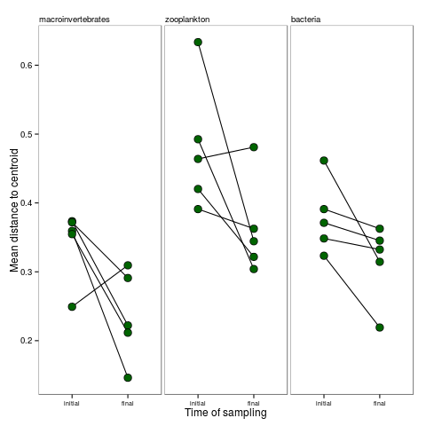

# Exploratory figures

# Dispersion

mixed effect ANOVA table

|            | numDF| denDF|     F-value|   p-value|
|:-----------|-----:|-----:|-----------:|---------:|
|(Intercept) |     1|    20| 837.1699446| 0.0000000|
|taxa        |     2|    20|   9.9229148| 0.0010150|
|timing      |     1|    20|  15.4715289| 0.0008221|
|taxa:timing |     2|    20|   0.4375683| 0.6516385|

residual plot for the dispersion model
 

Figure  1: This is the different mean differences to centroid on the same plot. shown is the 1:1 line.

## Dispersion

|term      | df|     sumsq|    meansq| statistic|   p.value|
|:---------|--:|---------:|---------:|---------:|---------:|
|Groups    |  2| 0.0027411| 0.0013706| 0.0710147| 0.9316216|
|Residuals | 27| 0.5210939| 0.0192998|        NA|        NA|

|term      | df|     sumsq|    meansq| statistic|   p.value|
|:---------|--:|---------:|---------:|---------:|---------:|
|Groups    |  2| 0.1576358| 0.0788179|  2.994272| 0.0669126|
|Residuals | 27| 0.7107178| 0.0263229|        NA|        NA|

|term      | df|     sumsq|    meansq| statistic|   p.value|
|:---------|--:|---------:|---------:|---------:|---------:|
|Groups    |  2| 0.0013260| 0.0006630| 0.4047036| 0.6711544|
|Residuals | 27| 0.0442309| 0.0016382|        NA|        NA|

# PERMANOVAS

## initial

### inverts

|          | Df| SumsOfSqs|  MeanSqs|  F.Model|       R2| Pr(>F)|
|:---------|--:|---------:|--------:|--------:|--------:|------:|
|species   |  2|  27029.33| 13514.67| 7.032039| 0.342491|  0.001|
|Residuals | 27|  51890.50|  1921.87|       NA| 0.657509|     NA|
|Total     | 29|  78919.83|       NA|       NA| 1.000000|     NA|

### zooplankton

|          | Df| SumsOfSqs|  MeanSqs| F.Model|        R2| Pr(>F)|
|:---------|--:|---------:|--------:|-------:|---------:|------:|
|species   |  2|   15666.0| 7833.000|  2.5853| 0.1607244|  0.008|
|Residuals | 27|   81805.2| 3029.822|      NA| 0.8392756|     NA|
|Total     | 29|   97471.2|       NA|      NA| 1.0000000|     NA|

### bacteria

|          | Df| SumsOfSqs|  MeanSqs|   F.Model|        R2| Pr(>F)|
|:---------|--:|---------:|--------:|---------:|---------:|------:|
|species   |  2|  22.46667| 11.23333| 0.6855787| 0.0483293|  0.085|
|Residuals | 27| 442.40000| 16.38519|        NA| 0.9516707|     NA|
|Total     | 29| 464.86667|       NA|        NA| 1.0000000|     NA|

## final
### insects

|          | Df| SumsOfSqs|   MeanSqs|  F.Model|        R2| Pr(>F)|
|:---------|--:|---------:|---------:|--------:|---------:|------:|
|species   |  2|  59463.67| 29731.833| 6.418015| 0.3222216|  0.001|
|Residuals | 27| 125079.10|  4632.559|       NA| 0.6777784|     NA|
|Total     | 29| 184542.77|        NA|       NA| 1.0000000|     NA|

### zooplankton

|          | Df| SumsOfSqs|   MeanSqs|  F.Model|        R2| Pr(>F)|
|:---------|--:|---------:|---------:|--------:|---------:|------:|
|species   |  2|  3104.733| 1552.3667| 1.749576| 0.1147295|  0.158|
|Residuals | 27| 23956.600|  887.2815|       NA| 0.8852705|     NA|
|Total     | 29| 27061.333|        NA|       NA| 1.0000000|     NA|

### bacteria

|          | Df| SumsOfSqs|  MeanSqs|   F.Model|        R2| Pr(>F)|
|:---------|--:|---------:|--------:|---------:|---------:|------:|
|species   |  2|  23.33333| 11.66667| 0.6344411| 0.0448862|  0.027|
|Residuals | 27| 496.50000| 18.38889|        NA| 0.9551138|     NA|
|Total     | 29| 519.83333|       NA|        NA| 1.0000000|     NA|

# multivariate GLM

results of multivariate GLMS

## diagnositic plots for full models
 

 

 

## ANOVA tables for full models
Analyis of deviance 

|term          | Res.Df| Df.diff|      Dev| Pr(>Dev)|
|:-------------|------:|-------:|--------:|--------:|
|(Intercept)   |     29|      NA|       NA|       NA|
|Block         |     25|       4| 109.7867|    0.150|
|species       |     23|       2| 123.4727|    0.002|
|Block:species |     15|       8| 150.3358|    0.038|

|term          | Res.Df| Df.diff|      Dev| Pr(>Dev)|
|:-------------|------:|-------:|--------:|--------:|
|(Intercept)   |     29|      NA|       NA|       NA|
|Block         |     25|       4| 46.35160|    0.104|
|species       |     23|       2| 55.03097|    0.002|
|Block:species |     15|       8| 51.67825|    0.012|

|term          | Res.Df| Df.diff|        Dev| Pr(>Dev)|
|:-------------|------:|-------:|----------:|--------:|
|(Intercept)   |     29|      NA|         NA|       NA|
|Block         |     25|       4| 2210.04170|     0.02|
|species       |     23|       2|  673.64723|     0.02|
|Block:species |     15|       8|   30.72662|     0.06|

## manyglm

test for interactions

# Dispersion

*Question 1: less beta diversity among smaller organism types* 
If smaller taxa have broader fundamental niches, we should see less variation in community composition among
bromeliads for smaller organism types. That is, we should see less beta
diversity among bromeliads at the end of the experiment (following community homogenization) than we saw at the
beginning. We tested this by calculating multivariate dispersions
[@Anderson2006] between all six bromeliads (i.e. distances to centroid of all
bromeliads within one block) before and after the experiment. We repeated this
comparison for all five blocks, and for all three organism types. We used the
`betadisper` function in the R package vegan [@vegan], which provides a
permutation test to test for differences in dispersion before and after the
experiment within each block (999 null simulations block^-1^). For the
purposes of this analysis, we used the Raup-Crick measure of dissimilarity. We
extracted the mean distance to centroid (Figure  2) for each block
before and after the experiment. We did this because our hypothesis concerns
an interaction: specifically, that the effects of homogenization and recovery on mean distance to centroid
(i.e. the slopes of lines in Figure  2) declines with decreasing organism
size. This allowed us to test these differences with a mixed effect linear
model including the main effect of sampling time (before and after) organism
type (macroinvertebrate, zooplankton and bacteria) and their interaction, with
a random effect for block.

Figure  2: Mean distance to centroid, before and after the experiment, for each of the three organism types. Each dot represents the mean distance to centroid for all six bromeliads in a block, and lines connect initial and final measurements of the same block.

We found that dispersion, in all cases, was lower at the end of the experiment
than at the beginning. This indicates that our treatments were effective in
homogeneous (or nearly-homogeneous) starting communities. This is important,
because it demonstrates that our inability to detect a species effect in
PERMANOVAs of bacteria does not reflect an inability to detect differences
among bacterial communities. However, the amount of this decline was the same
across all organism groups as indicated by the absence of a significant
interaction (` Stab("disp_tab")`). However, this method assumes that
homogenization occurred for all communities to the same degree. This is
unlikely to be the case: though we were able to count and precisely calculate
the starting insect community composition, we were obliged to use random
subsamples of the zooplankton and bacteria communities. This means that while
all communities began with the same invertebrate composition, they probably
began with slight variation in zooplankton and bacteria composition.
