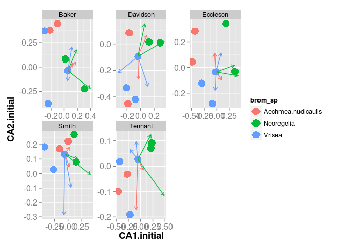

Introduction
============

Previous observational studies (Farjalla et al. 2012) have shown that
larger bodied organisms show a greater degree of habitat filtering:
there is greater environmental structure as body size increases from
bacteria (weak), zooplankton (intermediate) and insects (strong). This
is especially interesting as these different environments are caused by
variation in habitat preference among several bromeliad species -- some
species are found under shrub cover, while others are meters away in
full sun.

Sun and shade habitats have different species compositions. This may be
caused by organism' s local environmental tolerances; sensitivity to
heat may vary among the three groups of organisms studied. However,
species compositions may also be affected by the effects of temperature
fluctuations on metabolism. Warmer animals may show increased feeding
rate, which may increase top-down regulation and alter both density and
richness of lower trophic levels.

In this experiment we will test these observations by homogenizing these
communities, removing variation among communities as much as possible.
We hypothesize that as habitat filtering acts, via mortality and -- for
non- metamorphosing organisms -- reduced fecundity, we will observe a
'relaxation' of the community towards the orginal species composition.
We hypothesize that this relaxation will be greatest for insects, less
for zooplankton and nearly zero for bacteria.

Methods
-------

We performed two complementary experiments to test how different groups
within these communities respond to environmental variation. In each
experiment, we removed the communities from bromeliads, sampled them,
and then returned a homogenized community to all plants. Plants were
replaced in a similar local habitat to their original, and enclosed in a
mesh cage to prevent colonization. After a 12 day period, we sampled
communities again and tested for a 'relaxation' in composition towards
their original composition. In our first experiment (among-species) we
tested how sensitivy to different bromeliad species. Our second
experiment (within-species) examined the effects of habitat
independently of species, by comparing communities within the same
bromeliad species in open- and closed-canopy habitats.

We performed these experiments at the Parque Nacional de Jurubatiba, in
Rio de Janeiro state, Brazil (22 ∘  S 41 ∘ ). For
our between--species experiment we used *Aechmea nudicaulis*,
*Neoregelia cruenta*, and *Vriesea neoglutinosa*; our between --habitat
experiment used *Neoregelia cruenta* only, sampled from exposed and
shaded habitats. *N. cruenta* is both common and highly plastic,
occuring in a broader range of habitats than any other bromeliad in this
study site.

Macroinvertebrate communities were sampled by washing the plants
throughly and seiving the water through a (dimenions) sieve. They were
identified to the lowest taxonomic level possible in the field (genus or
family). Homogenized communities were the arithemetic mean of the
densities of each group in original communities (though often quite a
bit lower because of natural mortality).

To homogenize zooplankton, protist and bacteria communities, we
collected and equal volume of inoculum from each plant, mixed and
returned equal volumes to all bromeliads. In our first experiment we
used 100ml of inoculum from each plant, because *A. nudicaulis* is very
small and this was the maximum volume we could obtain while
simultaneously selecting average-sized plants.

Results
-------

List of figures
---------------

### Figure 1 Insect community

change over time in the inter-species experiment. The graph is based on
a non- metric multidimensional scaling of a euclidian distance matrix
among communities. Each dot represents the initial (observed) community
composition of each bromeliad; dots are coloured according to species.
We formed 'homogenized' communities by allocating six bromeliads (two of
each species) to blocks and dividing the combined invertebrate community
evenly among them. Arrows show the change from this identical starting
community to the composition at the end of the experiment (position of
the arrow head).A test of our hypothesis requires these arrows
(representing community 'relaxation' back to the original composition)
be both in a nonrandom direction (ie tending to point to intial
compositions) *and* longer for insects than for zooplankton, which in
turn show larger change than bacteria.

### Figure 2

The temporal variation in temperature between two habitats -- open and
closed. The effect of a very cold day can be seen on the right.

Literature Cited
----------------

Farjalla, Vinicius F, Diane S Srivastava, Nicholas a C Marino, Fernanda
D Azevedo, Viviane Dib, Paloma M Lopes, Alexandre S Rosado, Reinaldo L
Bozelli, and Francisco a Esteves. 2012. “Ecological Determinism
Increases with Organism Size.” *Ecology* 93 (7) (July): 1752–9.
<http://www.ncbi.nlm.nih.gov/pubmed/22919920>.
