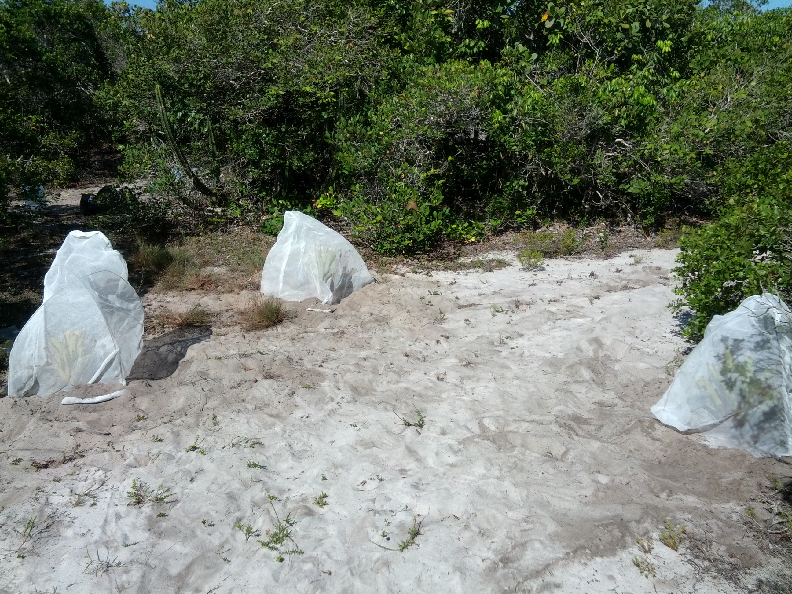

## Habitat filtering and organism size.

This project tests the hypothesis that the fundamental niche of different organisms is negatively correlated with body size; a pattern reported by [Farjalla et al. 2003](http://www.ncbi.nlm.nih.gov/pubmed/22919920)

### License

 Habitat filtering and organism size by MacDonald AAM, Srivastava DS and Farjalla VF is licensed under a <a rel="license" href="http://creativecommons.org/licenses/by/3.0/deed.en_GB">Creative Commons Attribution 3.0 Unported License</a>.